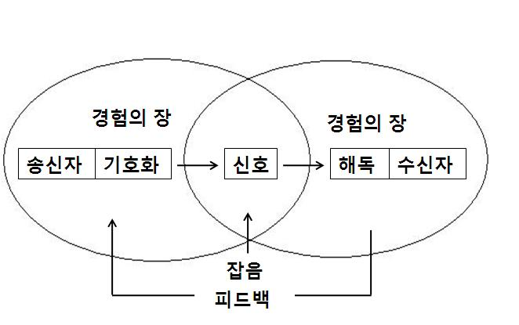
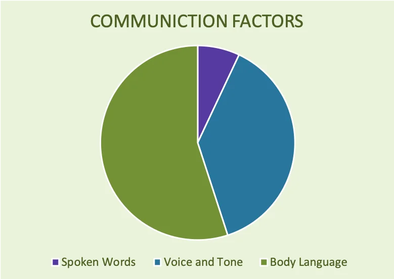
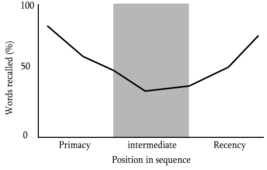
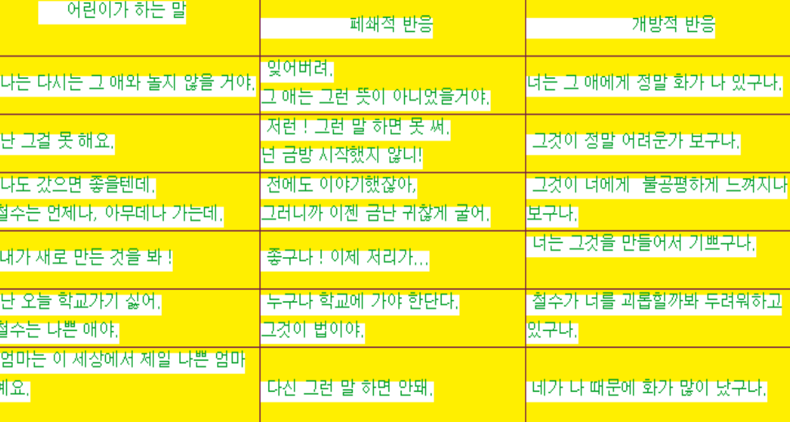
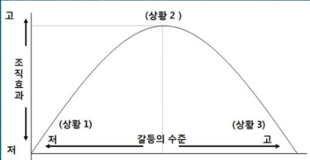
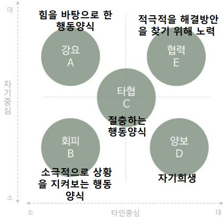

# 1. 인간관계
## 1. 인간관계의 중요성
1. 신 휴머니즘 사회의 도래
2. 인간관계: 두 사람 혹은 그 이상의 사람들 상호 간에 일어나는 관계
   - 관계: 두 사람 사이의 일련의 상호작용이 이뤄짐
   - 상호작용: 서로 행동, 반응하고 상호작용을 계속 반복함으로 할 수 있을 때 관계가 성립(정서적, 인지적)
   - 호손 실험 / 피그말리온 효과 / 플라시보 효과
3. 삶의 만족도와 행복지수를 높일 수 있음
   - 긍정적 인간관계: 내재적 욕구 만족, 자존감 향상, 정신/신체건강에 중대한 영향
   - 최첨단 기술의 사용으로 신체적 접촉의 필요성이 점차 감소
4. 인간관계를 통한 이점 : 정서적 지지,다양한 정보, 실제적 도움 등
5. 인간관계가 불만족, 비효과적 일 때 성장과 발달이 방해를 받음
6. 스트레스를 줄이고 건강한 삶을 유도할 수 있다
7. 있는 그대로의 나 vs 가식적인 나
   - 정직한 자기개방으로 당하게 될 위험이 강력하리라 우려
   - 다른 사람을 신뢰하지 못함
   - 나 자신을 오해하고 있음 또는 남이 나를 어떻게 볼지 이해하지 못함
   - 외로움을 경험하고 자기 성장에도 방해 -> 건전한 인간관계가 발달되지 못함

-  인간관계를 통해 삶의 만족도와 행복지수를 높일 수 있고, 스트레스를 줄이고 건강한 삶을 유도할 수 있다. 반면 인간관계에 불만족하거나 비효과적인 인간관계를 가질 때는 성장과 발달이 방해받는다.

## 2. 인간관계 유형
### 만남과 스침의 관계
   - 만남 : '있는 그대로의 너' & '있는 그대로의 나'
   - 스침 : '나 자신의 가면' & '너 자신의 가면' -> 무의미하게 시간과 정력을 낭비하는 피상적 관계
### 공식적 관계, 비공식적 관계
   - 공식적 관계: 물리적 환경으로 인해 발생되는 작업과 정상의 관계로 맺어지는 것
   - 비공식적 인간관계: 제도와 조직을 초월한 구성원 상호간의 인격적, 사회적 교류관계에서 발생하는 관계
### 전문적 관계와 사교적 관계
  - 전문적 관계: 과학적 지식과 특별한 기술을 요하는 요구와 문제를 지닌 사람을 돕는 관계(목적을 향해 나아감)
    - 대상자의 성장을 촉진
  - 사교적 관계: 두 사람 사이에 즐거움과 친목을 위해 이루어지는 관계
    - 의무감, 책임감 X

## 3. 전문적 관계 형성에 필요한 특성
### 1. 인간에 대한 깊은 관심
  - 인간의 본질을 역동적, 창조적 이해
  - 자신, 대상자의 행동과 이면의 동기에 대해 깊이 이해하고 탐구하는 지적 관심
  - 타인을 돕고자 하는 따뜻한 마음
### 2. 자기인식 / 자기이해
  - 신체적 요소: 신체의 감각(감정과 관련된 정서적 각성), 신체상, 신체적 변화, 증상, 기질
  - 환경적 요소: 사회,문화적 환경, 타인과의 관계, 인간과 자연과의 관계에 대한 지식
  - 심리적 요소: 감정, 동기, 인격에 대한 지식
  - 철학적 요소: 자신의 삶이 지닌 진정한 의미를 인식하는 것

# 2. 인간의 이해
## 1. 성격 (교육학 - 인성, 심리학 - 성격, 정신분석학 - 인격)
- 인격: 개인의 특징적인 속성, 욕구, 야망, 억제, 능력, 약점 및 방어 등을 포함
  - 넓은 의미에서 인간의 성격, 지적/도덕적인 면을 두루 포함
- 인격의 유래: 희랍어 페르조나(persona)
  - 고대 희랍 연극에서 배우들이 쓰던 가면을 지칭
- 성격: 주어진 환경에 대응하는 나의 생각, 감정, 의지, 행동의 체계
- 성격 발달 이론
  - 프로이드: 만 5세까지의 경험에 의해 골격이 완성되고 청소년 시기에 완성된다고 봄
  - 에릭슨: 전 생애를 통해 발달, 성숙한다고 봄. 자아정체감 강조
### 1. 성격의 구조
성격은 자아, 초자아, 본능으로 구성
- 본능: 쾌락의 원칙, 일차과정적 사고
- 자아: 현실의 원칙, 이차과정적 사고
- 초자아: 도덕적 규범, 이성적
- e.g.
  - 본능: 저 물건을 갖고 싶다
  - 자아: 가질 수 있는 현실적인 방법을 찾아보자
  - 초자아: 훔치는 것은 나쁘다
#### 1. Id(원욕, 본능)
- 성격의 기초를 형성하는 것으로 태어날 때부터 존재하는 기본적, 생물적 반사 및 충동(무의식, 전의식 영역)
- 음식, 물 배설, 보온 등의 욕구와 성적 욕구, 공격적 욕구
- 기능: 옳고 그름의 감각이 없고 욕구의 즉각적인 만족만을추구하는 이기적이며 모든 정신력의 근원이 되는 성격의 부분
  - 쾌락원리에 따라 움직임
  - 현실과 환상의 구별이 없음 - 원시적 사고
  - 비논리적, 비언어적이고 체계가 없다(영아의 사고, 꿈의 내용, 정신병 환자들의 환각)
#### 2. 초자아(superego)
- 자아로부터 분화되어 나온 것으로 인간의 마음 안에서 행동의 옳고 그름을 평가하는 재판관과 같은 역할을 하는 성격의 부분
- 양심(잘못된 행동에 대한 죄책감, 자아이상(선한 행동에 대한 보상으로 상적 자아상 형성))
- 양심은 1세부터 생겨나기 시작해 5-6세에 주로 발달, 9-11세에 완성
- 부모를 동일시하며 무의식적으로 생겨남(부모의 역할모델이 많은 영향을 미침) - 오이디푸스 콤플렉스
- 형성 시기에 적절한 인정과 칭찬이 매우 중요
- ??
#### 3. 자아(ego)
- 즉각적 충동을 연기시키고 현실을 고려하도록 하는 주체
- 기능: 
  - 현실의 원리에 따름
  - 논리적, 객관적, 언어적 사고
  - 유기체의 본능적 욕구와 주위 환경의 상태를 조정
  - 정신방어기전
## 2. 에릭슨의 발달 단계

| 심리 사회적 위기         | 시기     | 중요 관계 범위 | 연령        | 획득                                                                   |
| ------------------------ | -------- | -------------- | ----------- | ---------------------------------------------------------------------- |
| 신뢰감 vs 불신감         | 영아기   | 어머니         | 출생~18개월 | 히ㅡ망                                                                 |
| 자율성 대 수치심         | 유아기   | 부모           | 18개월~3세  | 의지                                                                   |
| 주도성 대 죄의식(죄책감) | 아동전기 | 가족           | 3~6세       | 위기를 잘 극복하면 목적이 생기고 극복에 실패하면 억제가 생김           |
| 근면성 대 열등감         | 아동기   | 이웃, 학교     | 6~12세      | 능력                                                                   |
| 자아정체감 대 역할혼미   | 청소년기 | 또래집단       | 12~22세     | 또래 집단과 중요한관계를 맞는 것, 성실                                 |
| 친밀감 대 고립감         | 성인초기 | 우정, 애정     | 22~35세     | 성인 초기의 친밀감은 성적인 것 이상으로 사회적 친밀감도 포함된다. 사랑 |
| 생산성 대 정체감         | 중년기   | 직장, 확대가족 | 35~65세     | 자녀를 양육하는 것으로 생산성을 획득. 배려                             |
| 자아통합 대 절망감       | 노년기   | 연류, 동족     | 65세 이후   | 노년기에 삶에 잘 적응하고 만족하면 자아통합을 하게 됨. 지혜            |

## 3. 정신방어기제
- 초자아와의 압력으로부터 개인을 보호하기 위해 사용되는 전략
- 본능이 발현되려고 할 때 ego가 반응하는 방법:
  - 봉쇄, 왜곡 -> 안정감, 자존감 유지, 정서적 문제 해결
  - 신체적 위험 -> 자기보존 방어 발동 
  - 심리적 위협 -> 보호적 정신방어기제 적용
  - 억제를 제외한 나머지는 무의식적으로 일어나며 실제 적용은 자아의 역할
- 자신은 방어기제를 쓰는 것이 잘 보이지 않으나 남은 잘 보임
- 근본적인 스트레스 해소나 문제 해결은 되지 않음
- 방어기제의 빈도, 강도, 지속성의 적절성은 중요하며 성숙한 기제를 사용

> 문제 출제 -> 어떤 방어기제를 사용했는지

1. 억압
   - 모든 갈등을 처리하는 데에 일차적으로 쓰여지는 기본적 정신방어기제(많이 사용하면 히스테리적 성격)
   - 무의식적으로 불쾌한 것들을 강력하게 몰아내고, 억누르는 가장 보편적, 선차적 기제
   - 억압된 내용들이 의식화되는 것을 막기 위해 다른 방어기제들이 사용됨
   - 무의식계로 밀어내는 일종의 선택적 잊어버림
2. 억제
   - 의식에서 의도적으로 쫓아내려는 기제
   - e.g. 휴가가서 복잡한 회사일을 의식적으로 생각하지 않으려고 함, 무서운 거리에서 의도적으로 명랑한 노래 부르기
3. 합리화
   - 무의식적이며 잘못된 행동을 하고 나서 그럴듯한 이유를 대며 체면 유지와 자기보호를 함
   - 심하면 자기기만이나 망상을 형성
   - e.g. 이솝우화 - 여우와 신포도, 내로남불, 호상
4. 전치
   - 대인관계에서 일어나는 감정의 이동으로 원래의 대상에게 가졌던 감정이 왜곡, 분리되어 다른 대상에게 이동
   - e.g. 동에서 뺨맞고 서에서 화풀이
   - 부부싸움 후 직장 부하에게 화풀이
   - 미운 언니의 공책 찢기
   - 순기능: 안전한 상황에서 안전한 방법으로 고통 해소. 고통을 준 대상과 전치대상의 유사성이 중요(역할놀이)
5. 대리형성
   - 목적한 것을 이루지 못했을 때 (다른 만족을) 취해 만족을 얻음
6. 투사
   - 자신의 용납할 수 없는 충동이나 특성을 타인에게 돌리는 것
7. 퇴행
   - 스트레스 상황에서 이전 발달 단계의 행동으로 돌아가는 것
8. 고착
   - 정서적 발달이 일정 수준에 머물러 있는 병적 (빈칸)을 보이는 증상
9. 승화
   - 가장 건전한 방어기제
10. 반동형성
    - 용납할 수 없는 충동과 정반대되는 태도나 행동을 보이는 것
11. 전환
    - 심리적 갈등이 신체감각기관이나 수의근계의 증상으로 표출되는 것 (신체화의 한 형태)
12. 신체화
    - 심리적 갈등이 신체적 증상으로 나타나는 것 (전환과 유사/포괄적 개념)
13. 부정
    - 불안을 유발하는 현실을 인식하지 않으려는 것
14. 보상
    - 자신의 결함을 메우거나 또는 체면을 유지하려는 기제
    - 부족한 부분을 다른 영역에서의 성취로 만회하려는 것
15. 상환(취소)
    - 죄책감으로 인해 마음의 부담을 감소시키고자 하는 현상
    - 죄책감이나 불안을 유발하는 생각이나 행동을 무효화하기 위해 반대되는 행동
16. 행동화
    - 스트레스를 받은 즉시 분출하는 것 (충동적 행동으로 내적 갈등을 표현)
17. 자기에로 전향(투척)
    - 모든 원인을 자기에게 돌려서 생각하는 것 (투사의 반대 방향으로 작용)


# 3. 나는 누구인가?
## 1. 나의 자아상
### 1. 자기(self) - 칼 로저스
- 자기 체험을 통해 자기를 구성해나감
  - 주관적 경험 -> 자기를 구성 -> 행동을 지배
- 자기란 개인이 지각하는 나, 즉 자기개념이며 한 번 형성되면 잘 변하지 않는다
- 객관적 특성이 비슷해도 자기개념은 다르게 형성됨
### 2. 자아개념
#### 1. 자아개념의 발달(칼 로저스)
- 자아개념 형성에 영향을 미치는 요인: 유아기, 아동기 초기에 경험한 타인의 평가
  - 특히 중요한 타인인 부모, 형제, 친척의 평가가 중요한 영향을 미침
- 자아개념의 출현: 유아는 분화를 통해 점차로 자신을 제외한 나머지 세계와 자신을 구분하기 시작(타인인정, 자신과 다름을 앎)
  - 자아개념이 분화, 복잡해짐
- 자아중심적 사고: 타인의 생각, 감정 등이 자신과 동일하다 믿고 타인의 관점을 이해하지 못하는 경향(집단적 독백)
- 자존감(자아존중감): 자신에 대한 평가적 개념으로 자신의 장단점을 받아들이는 것
- 자신감: 자신에 대한 느낌으로 비교우위적 단어. 어떤 것을 잘했을 때 오는 것
#### 2. 긍정적 존중 욕구
- 긍정적 존중에 대한 욕구: 중요한 타인(주로 양육자)의 인정, 존경, 따듯함, 숭배, 사랑, 수용을 받고 싶어함
  - 아동의 자기의식이 생김에 따라 지속적으로 발달
- 자신의 본질적 욕구를 희생하면서까지 추구(착한 아이 콤플렉스)
- 자기 자신으로부터 긍정적 존중을 받고자 하는 욕구를 가짐
-   성공은 긍정적, 실패는 부정적 자존감을 갖게 함
- 학습에 의한 것
#### 3. 조건적 긍정적 존중
- 어떤 사람이 다른 사람의 기대에(조건) 일치하는 행동을 함으로써 칭찬, 주목, 인정을 받는 상황
- 아동은 자기자신이 아닌 타인이 자신을 보듯 자기를 지각하며, 자신의 가치를 평가하는 데에도 조건을 붙임
- 이상적 자아를 위해 노력하는 것이 아닌 타인의 기준에 맞추려 노력함
- 자신의 행동을 제한시키고 현실을 왜곡
#### 4. 무조건적 긍정적 존중
- 조건 엇ㅂ이 존중 및 인정을 해주는 것
- 무조건적 수용은 행동이 아닌 감정을 의미
  - e.g. 형이 동생을 때려 화가 난 어머니
    - 조건적: 동생을 잘 데리고 놀았을 때에만 사랑하는 엄마
    - 동생을 때렸어도 엄마의 사랑은 변함이 없다
### 3. 나의 긍정도 검사

### 4. 자존감
자존감: 자기 자신을 얼마만큼 사랑하고 존중하며 어떠한 목표를 세워 성취하고자 할 때 할 수 있다는 자신에 대한 믿음
- 어떤 위기 상황이나 올바른 판단을 해야할 때 중요한 지침서 역할을 담당
- 자신을 존중하고 사랑하는 사람은 다른 사람을 존중하고 사랑할 수 있기 때문에 인간관계에서 효과적
- 자존감이 높은 사람: 타인을 존중, 자비, 친절, 높은 공평
#### 1. 낮은 자존감의 특징
- 삶의 초점을 남에게 맞추고 항상 타인에 의해 자신의 삶이 조절된다고 믿음
- 어려운 상황에서 파괴적 행위를 함
  - 대부분 남탓
  - 실패를 배움의 기회로 만들지 못 함
- 대인관계가 어렵다
  - 자신에게 하는 것처럼 남에게도 가혹한 잣대
- 부정적 태도를 가짐
  - 실패를 자신의 무능함, 사회현상, 운으로 돌림
  - 성공을 운으로 돌림
- 과거지향적 태도
  - 과거 중심의 대화를 반복
- 열등감을 감추려고 함
#### 2. 높은 자존감의 특징
- 미래 지향적이며 이미 지나간 실수나 실패에 과다하게 집착하지 않음
- 문제나 실망한 일이 있어도 해결하는 능력이 남다름
  - 상대가 실수해도 문제에 집중하고 감정 조절이 가능
- 평가를 개인적인 일로 받아들이는 것이 적음
- 다른 개개인을 존중하고 존중받을 권리가 있다고 생각
- 다양한 면에서 자신감 있고 도전적인 행동을 보임
#### 3. 높은 자존감 만드는 법
- 자존감 도둑: 비교/비약/비난을 많이 하는 사람. 누군가를 공격해 불편한 감정을 해소하려고 함
- 자신의 자존감을 낮게 하는 요소를 찾아냄
- 자신의 한계를 인정하고 받아들임
- 자신이 내린 결정에 책임을 짐
- 어렸을 때 자신이 결정을 내린 경험이 많으면 자존감이 높다
- 목표 설정 후 전문성 발달
- 자기 자신에게 긍정적 말 사용
- 할 수 없다는 생각을 할 수 있다는 긍정적 태도로 전환
  - 높은 자존감: 주어진 문화에 따라 행동
  - 너무 높은 자존감: 소외당함

## 2. 열등감
열등감: 자아상의 어두운 면, 버리고 싶은 모습들. 다른 사람들에 비해 뒤떨어졌거나 능력이 없다고 생각하는 만성적인 감정, 의식
- 누구나 열등감을 가지고 있지만 받아들이고 어떻게 다루는 가에 따라 긍정적/부정적 삶을 살 수 있다.
- 인간은 누구나 무능, 열등한 존재로 출발 -> 극복을 위해 우월함을 추구 -> 동기와 노력을 자극
### 1. 근원
1. 신체기관의 열등
   - 질병, 외모와 같은 신체와 관련된 열등감
2. 과도한 응석
   - 과잉보호하는 양육 태도로 아이의 자발성을 훼손시켜 자신의 능력에 대한 열등감을 느낌
3. 열등하다는 평가
   - 자신의 능력에 대한 열등감. 거부적 양육태도로 인해 무가치함을 느끼게 되는 것
### 2. 열등감의 보상
- 자신의 부족함을 다른 특성으로 보충하고자 하는 것
- 유형: 행동을 하게 하는 추진력, 반사회적 행동을 일으키는 원인, 과보상
### 3. 열등감의 징후
- 자신을 과시하려 함자신을 지나치게 방어
- 자신과 같은 입장에 있지 않은 사람을 적대시
- 타인을 비판, 비교하기 좋아함
- 타인을 무시 혹은 숭배
- 박해받는 느낌
- 경쟁에 대한 부정적 감정
### 4. 다루는 법
- 나의 가치를 인식
- 내가 할 수 있는 일에 관심을 가짐
- 자신을 칭찬
- 부정적 생각의 사슬을 끊음
- 비전 품기
- 자기를 버려야 함(자기 중심의 삶을 버리기)
- 완벽한 나가 아니라 있는 그대로의 나를 추구
- 주변에 베풀고 봉사

## 3. 자기개방과 조해리창
### 1. 자기개방의 의미
- 비밀을 없애고 명백히 하며 보여주는 것. 개인이 의식적으로 언어적 혹은 비언어적 수단을 통해 자신의 정보를 타인에게 알려주는 것다른 사람이 나의 부정적 측면을 알고서 나를 좋아하지 않을 것이라 생각해 자기개방을 못함자기개방을 위해선 자기를 정확히 이해하고 자아 수용을 해야 함
- 자아수용: 자신의 신체적 조건, 생리적 현상, 느낌, 생각, 행동, 가치관, 성격, 자신이 처한 상황 등을 그대로 받아들이는 것
### 2. 조 해리의 창(개방성)
#### 1. 자아의식모델
- Joseph Luft와 Harry Ingham(1955)
- 조 해리의 '마음의 창문'
- 세로축: 자아개방 정도, 가로축: 타인으로부터 받는 피드백 정도
- 자기를 이해 -> 자아수용 -> 자기개방 가능
1. 개방된 영역
   - 나도 알고 다른 사람들도 아는 나의 모습
   - 이 영역이 클 수록 공감대 형성
   - 내가 스스로 피드백을 요청하고 자기를 개방함으로써 점점 더 커짐
2. 지각하지 못하는 영역(가려진 영역)
   - 다른 사람들은 잘 알지만 나는 잘 모르는 나의 모습
   - 다른 사람들과 생산적인 관계를 맺지 못하고 자기 이해가 부족한 사람들
   - 이 영역이 크면 다른 사람들과 갈등이 일어나기 쉽다
   - 잘난척, 눈치없거나 우둔한 사람
3. 감춘 영역(숨겨진 영역)
   - 나는 잘 알지만 다른 사랃믈은 잘 모르는 감춰진 나의 모습
   - 스스로 민감하여 자기 자신을 잘 아는 편이나 자기 자신을 수용하지 못하며, 남에게 있는 그대로 드러내길 싫어함
   - 자신이 다른 사람들에게 공개하고 싶지 않은 정보를 숨겨둔 부분
   - 다른 사람과 생산적인 관계를 맺는데 지장이 있고 자기의 기능을 발휘하지 못함(불안, 긴장, 은폐)
   - 관계가 밀접해지고 신뢰가 깊을 수록 좁아짐
4. 알려지지 않은 영역(미지의 영역)
   - 나도 모르고 다른 사람들도 모르는 자신의 모습
   - 인간의 심층부에 윙치해 극적 통찰을 통해 정보를 파악할 수 있음(무의식)
     - 심리치료, 충격적 경험, 우발적 사건, ...
   - 개방된 영역으로 새로운 정보의 이동을 촉진하기도 함
바람직한 인간관계 발달: 개방된 영역을 확장하는 것
  - 다른 사람을 신뢰할 수록, 내가 수용적이고 개방적일 수록
### 3. 자기개방의 정도
- 개인이 자기를 개방하는 것은 무조건 개방하거나 모든 내용을 똑같은 수준에서 개방하는 것은 아님
- 자기개방의 폭: 여러 가지로 자기 개방을 많이하는 것
- 자기개방의 깊이: 자기개방의 심청 정도
- 인간관계 초기: 자기개방의 폭이 좁고 깊이가 얕음

### 4. 인간관계 유형

<table border="1">
  <tr>
    <td rowspan="2">타인이\자기가</td>
  </tr>
  <tr>
    <td>아는 부분이 클 수록</td>
    <td>모르는 부분이 클 수록</td>
  </tr>
  <tr>
    <td>아는 부분이 클 수록</td>
    <td>
      개방형
    </td>
    <td>
      주장형
    </td>
  </tr>
  <tr>
    <td>모르는 부분이 클 수록</td>
    <td>
      신중형
    </td>
    <td>
      고립형
    </td>
  </tr>
</table>

#### 1. 고립형
- 피드백도, 자기개방도 없는 유형
- 자신도 개방하지 않고 다른 사람과 대화나 정보 교환이 없기 때문에 인간관계를 형성하지 못함
- 모든 문제를 자기중심적으로 생각하고 행동
  - 자신은 불편함이나 죄의식이 없지만 상대방은 부담
  - 조짓가회의 골치
- 자신의 잠재력을 사장시킬 뿐만 아니라 다른 사람들의 의욕을 좌절시킴
#### 2. 자기 선전형(주장형)
- 상대방에게 자기 개방은 많이 하지만 상대방에게서 정보를 얻지 못하는 유형으로 대인관계에서 불균형
- 다른 사람에게어 정보를 많이 얻지 못하기 때문에 항상 자기를 중심으로 일어나는 문제에 대해 말을 많이 하는 유형
  - 자신에 대해 과장되게 선전하는 경향이 있어 가볍게 들어주기만 하면 됨(정보를 신뢰 x)
#### 3. 신중형
- 대인관계 초기에는 자기개방을 하는 척 하지만 실제로는 거의 하지 않고 상대방의 정보를 얻는 데에 급급한 유형
- 상대방은 시간이 지날 수록 이 유형의 사람을 경계
- 일정한 거리를 두며 자신의 정보를 노출하지 않아야 하며 너무 친하게도, 소원하게도 지내지 않는 것이 좋다.
#### 4. 개방형
- 주도적으로 자기를 개방하고 피드백도 받아 원만한 대인관계를 형성
- 솔직, 개방적, 감수성 뛰어남, 자신감, 안정적, 자기개방을 두려워하지 않음
- 타인에게 방어적이지 않음
  - 상대도 자신을 노출
- 상대방의 개방 정도와 피드백에 따라 자신을 개방

# 4. 효율적인 의사소통
## 1. 의사소통

의사소통: 대인관계를 원활하게 유지할 수 있도록 촉진하는 역할을 수행하는 중요한 수단
- 어원: communis. 공동의 것으로 만들다, 나누다, 전달하다, 참여하게 하다
- 정의: 두 사람 이상의 사람들 간 언어적, 비언어적 수단을 통해 그들의 의사, 사실이나 정보, 감정, 태도, 신념, 생각을 전달하고 반을을 받으며 상호간 의미를 공유하는 과정

## 2. 의사소통 과정과 구성 요소
### 의사소통 모형(쉐논슈람의 통신과정모형)


#### 위키피디아
송신자와 수신자가 공통된 경험의 장에서의 만남을 통하여 효과적으로 통신할 수 있음을 설명하고 있다.
송신자와 수신자가 통신하는 과정에서 오는 문제점을 피드백을 통해 보완할 수 있음을 설명하고 있다.
효과적인 통신을 위하여 잡음(물리적, 심리적 잡음 등)을 최소화하거나 제거해야 함을 강조한다.
- 송신자 : 수신자에게 전달할 내용, 전달 방식 등을 결정하는 주체이다.
- 수신자 : 송신자가 보낸 메시지와 주변 환경(잡음), 매체 등을 지각하여 의미를 해석하고 평가하는 주체이다.
- 메시지 : 송신자가 창출한 의미를 가진 자극을 말한다.
- 채널 : 송신자가 보내는 메시지와 수신자를 연결시켜주는 매체를 말한다.
- 피드백 : 송신자와 수신자의 상호작용에 의해 커뮤니케이션의 문제점을 수정하고 보완하는 과정을 말한다.
- 환경/잡음 : 커뮤니케이션에 참여하는 사람들을 둘러싼 물리적, 심리적 배경과 방해요인을 말한다.
  - 물리적잡음 : 메시지의 전달을 방해하는 외부 환경적인 잡음이다.
  - 심리적잡음 : 수신자의 내부적이고 해석적인 방해요소이다.

#### 강의
- 송신자: 메시지를 전달하는 사람
- 기호화: 말하기, 쓰기 등 메시지를 생산하는 행위
- 해독화: 듣기, 읽기 등 메시지를 이해하는 행동
  - 송신자가 생각이나 감정을 소리, 문자로 전환하여 기호화하고 수신자는 기호를 해독, 해석하여 두 사람은 의미의 공유(효과)가 일어남
- 메시지: 언어적, 비언어적 형태를 취하며 내용과 관계를 포함
  - 내용: 전달하려는 주체
  - 일방적 의사소통: 보내는 사람이 주도. 수신자에게 기대한 피드백이 제한적
    - e.g. 라디오, TV, ...
  - 쌍방적 의사소통: 두 사람 간 상호 역동적 의사소통
    - 많은 시간, 에너지, 질문의 개방성, 명료화, 적극적 경청이 요구됨
- 전달매체(채널): 송신자와 수신자 사이에서 메시지가 전달되는 수단
  - 언어적 채널: 송신자의 발음 기관, 음파, 젛놔, 편지, 전자우편, 수신자의 귀와 청각신경 등
  - 비언어 채널: 표정, 몸짓 등
- 수용자(수신자): 메시지를 받는 사람
- 잡음: 메시지의 송수신을 방해하는 모든 것
  - 잡음은 완전히 제거될 수 없으므로 감소하기 위한 노력이 필요
  - 문화적 배경, 남녀 차이, 집중도, 언어 이해력, 설명력, 경험 등
- 효과: 수신자가 커뮤니케이션 자극을 받고 보이는 반응 중에서 송신자가 의도했던 반응을 의미(의미의 공유)
- 피드백(feedback): 송신자가 의도대로 전달되었는가를 확인하는 과정
  - 언어나 비언어적 방법으로 이루어짐
  - 애매모호한 피드백은 오히려 방해
  - 피드포워드(feedforward) : 송신자가 앞으로 수신자에게 말하고자 하는 메시지에 대해 '이건 들은 이야기인데', '비밀을 지켜주어야 해'와 같이 미리 말함으로써 송신자가 원하는 대로 수신자가 들어주거나 반응해 주기를 바라는 것.
- 상황 : 의사소통을 구성하는 모든 요소를 둘러싼 환경
  - 물리적, 심리적, 사회적, 문화적, 시대적, 지리적 환경을 포함

## 3. 의사소통의 형태
### 1. 언어적 의사소통
- 언어를 통한 의사소통
- 구어적 방법, 문서적 방법
### 2. 비언어적 의사소통
- 언어적 의사소통만으로 표현하기 어려운 복잡 미묘한 감정이나 태도 등을 전달하는 데에 사용
- 중요성 상승
- 언어적 의사소통 과정을 효과적으로 진행 가능
#### 메라비언의 법칙



- 상대로부터 받는 이미지는 시각 55%, 청각 38%, 언어 7% - 비언어적 내용이 93%
- 말하는 자세가 말의 내용보다 중요
  - 전문가일수록 비언어적 표현의 중요성 강조
  - 비언어적 대화의 기술 SOFTEN 기법
    - Smile
    - Open Gesture
    - Forward Leaning
    - Touch
    - Eye contact
    - Nodding
- 표정: 감정을 표현하는 주된 비언어적 수단
  - 미소, 눈살 찌푸림, 인상 찡그림, ...
  - 필요에 따라 원하는 표정을 잘 조절하는 능력 필요
- 음성: 특정 부분에 대한 음성의 고저, 크기, 속도, 강약, 리듬, 억양, 잠시 멈춤, 웃음, 신음소리, 기침 등
  - 정서적 표현을 알아내는 데에 중요한 단서 제공
- 눈맞춤: 눈은 인간의 감정을 표현하는 통로
- 몸동작: 신체의 움직임을 적절히 사용해 메시지를 분명히 전달, 강조
- 접촉에 대한 반응은 스피커의 성별, 나이, 기대, 문화적 배경, 관계 정도 등에 따라 영향을 받음
- 공간활용: 심리적으로 가까운 사람과는 물리적으로도 가까움
  - 개인적 거리: 자기 바로 주위의 물리적 공간을 마치 자신의 일부로 취급하는 경향
  - Hall의 기본 구역 이론(단위: cm):
    - 친밀한 거리(가족, 애인): ~60
    - 개인적 거리(친구): 60~120
    - 사교적 거리(고객): 120~330
    - 공식적 거리: 330~

## 4. 대인지각
### 1. 인상형성
1. 단서
   - 어떤 사람을 직접 대면함으로써 얻을 수 있는 단서는 생김새, 신체의 크기, 체형, 자세, 행동(결과), 표정, 옷차림, 걸음걸이, 말소리, 동작 등(조작 시 오류)
2. 판단
   - 성격과 관련된 것이 많음
   - 변하지 않는 속성: 능력, 신뢰성, 태도, 성격, 기질
   - 변하는 속성: 기분, 감정, 노력, 의도
   - 외형적인 것: 고향, 출신학교, 나이, 역할, 교육 수준
3. 중심특질이론
   - 평가 차원(Evaluation): 좋다-나쁘다, 따듯하다-차갑다
   - 권력 차원(Potency): 세다-약하다
   - 활동 차원(Activity): 빠르다-느리다
   - 좋다-나쁘다의 개념을 가지는 평가 차원이 대인지각 인상 형성에 가장 강하게 작용
4. 판단에 영향을 주는 요인들
   - 보는 사람의 마음가짐
   - 지각의 왜곡
     - 후광효과
     - 초기효과
     - 긍정적 왜곡
     - 가정된 유사성
   - 타인에 대한 지식
   - 지식의 편견과 정확성
   - 상호작용에 대한 기대
### 2. 인상형성 과정
- 초두효과

  
  
  - 서열 안의 처음과 마지막 항목을 가장 잘 기억하고, 중간의 항목들을 잘 기억하지 못하는 기질
  - 이에 따라 대상 인물에 대해 상반되는 정보가 순서적으로 제시되는 경우 **먼저 제시된 정보가 나중에 제시된 정보보다 인상 형성에 더 큰 영향을 줌**
- 평균원리
  - 한 사람에 대한 긍정적/부정적 성격 특성을 동시에 접했을 때 사람들은 평가치를 평균해 인상 형성
- 최신효과
  - 시간적으로 나중에 제시된 정보에 의해 더 큰 영향을 받음

## 5. 의사소통을 방해하는 요소들
### 1. 도덕적 판단
- 자신의 가치관과 맞지 않는 타인을 부정, 판단
  - -> 비난, 모욕, 반박, 비판, 비교, 분석, 낙인
- 방어적, 저항적, 공격적 태도를 가지게 함
### 2. 비교하기
- 비판의 한 형태
- 경쟁, 비교를 당하면 불안, 두려움을 느낌
### 3. 행동의 책임 회피
- 자신의 행동에 대한 비합리적인 비판이 가해지면 스스로 책임을 회피
### 4. 감춰진 의도
- 욕구에 따라 감춰진 의도가 있다고 생각 -> 정보를 바꿔 생각함
- 대화를 방해하며 자신의 목적에 맞게 대화를 이끔
### 5. 강요
- 원하는 것을 타인에게 강요 -> 위협, 책망, 벌 등을 내포
- 권위자의 지위에 있는 사람이 많이 씀
### 6. 선입관
- 혈액형, 지방색, 남녀, 직업 등
### 7. 물리적 환경
- 소음, 기온, 마음을 산란하게 하는 조건 등에 의해 정보 왜곡

-------------------------------------------------------------------------
기말 범위

## 6. 효율적 의사소통 기술
### 1. 관심 기울이기
- 진지한 관심은 상대방을 위로하고 격려하며 상대방이 안전, 편안한 마음을 가짐으로 대화를 촉진 -> 신뢰, 친화관계 형성
- 신체적 이완, 자연스러운 자세, 부드러운 시선 접촉
- 상대방에게 주의를 집중하는 기술(비언어적 기술 사용)
  - 대상자를 향해 앉음
  - 개방적 몸 자세
  - 때때로 상대를 향해 몸을 기울여 앉음
  - 눈맞춤을 적절히 하고 긴장을 품

### 2. 경청
- 친밀감을 형성하고 유지하는 가장 중요한 기술
- 상대를 진정으로 이해, 공감하겠다는 의지의 표현, 상대방의 메시지에 반응하는 매우 적극적인 과정
- 귀(상대방의 말) + 눈(상대방의 신체적 언어) + 제3의 귀(심청:마음으로 듣고 공감)

#### 1. 무엇을 들을 것인가?
- 상대방의 비음성 언어를 잘 들어야 함(감정과 관련된 것이 많기 때문)
- 상대의 음성 언어를 잘 들어야 함(대상자의 사실, 생각, 감정, 정서)
#### 2. 어떻게 들을 것인가?
- 잘 경청하고 있다는 느낌을 받을 수 있도록
- 적극적 경청: 고개를 끄덕이며 음성적 반응을 보여 적극적으로 경청하고 있음을 전달(마음을 읽어서 전달)
- 소극적 경청: 음성적 반응을 적극적으로 보이지 않으면서 자신이 듣고 있음을 전달하는 방법(일반적 주의)
- 1,2,3 법칙: 대화 중 1분 동안 말하고, 2분 동안 상대방의 말을 들어주고, 대화 중 상대방의 말에 세 번 이상 맞장구치는 것
- 적극적 경청의 요소: 판단하지 않으며, __상대의 욕구(needs)에 공감__, 상대의 말 따라하기, 비언어적 반응

### 3. 개방적 질문
- 상대방의 관점, 사고, 의견, 감정을 이끌어낼 수 있으며 가급적 한 번에 한 가지씩 질문



### 4. 침묵
- 긍정적, 수용적 침묵: 상대가 말할 수 있도록 용기를 주고 생각을 정리할 시간을 줌
- 오해하지 않도록 수용적, 비언어적 행위, 대화를 계속 유지할 의도를 보여줘야 함

### 5. 상호이해확인
- 확인하기: 상대방이 하는 말을 옳게 듣고 이해했는지 알아보는 것
- 내용에 대한 확인하기 기법 - 의사소통 정확도 상승
#### 1. 반복
- 상대가 한 말을 그대로 반복(기계적 반복 X)
- e.g.
  - 요즘 왜 그런지 살 맛이 안 난다 -> 요즘은 왜 그런지 살 맛이 안 난다고요?
  - 조퇴를 해도 되겠습니까? -> 조퇴를 해도 되겠느냐고요?
#### 2. 바꿔말하기(치환)
- 상대방이 말한 용어와 비슷한 말을 사용해 간단하게 확인하는 것. 상대방이 한 말을 요점만 추려서 반복해 말해주는 것
- e.g. 바꿔말한다면... 그러니까 당신의 의견은... 당신은 지금 ...라고 말하고 있군요
#### 3. 요약
- 상대의 메시지를 압축해서 주제를 명확하게 하는 기술
- e.g. 얘기를 종합해보면 ...라는 이야기지? 결국 ...라는 이야기인 거지? 너 얘기는 ... 같은데 맞는 거야?

### 6. 반영
- 상대방의 입장에서 상대방에게 관심이 있음을 나타내는 방법
- 상대의 감정과 의미를 반영하는 개방적 반응을 의미함(느낌, 경험, 내용)
#### 1. 느낌 반영
- 대상자의 느낌을 자신의 견해를 넣지 않고 다시 표현하는 것
- 막연한 감정을 보다 분명하게 하는 것
- e.g. 죄책감을 느끼시는 군요. 몹시 싫으신 모양이군요. 많이 행복하신 것 같아요.
#### 2. 경험 반영
- 수신자가 비언어적 신체언어의 느낌을 관찰하고 피드백하는 것
- e.g. 웃음을 띄고 계시군요. 당신은 정말로 그녀를 사랑하시는 군요-그녀를 애기할 때 표정이 밝아지세요. 말씀하실 때마다 주먹을 꽉 쥐시는 군요.
#### 3. 내용 반영
- 근본적 생각을 간결하고도 분명하게 다시 말해주는 것(중요 단어 하나를 반복할 수도 있음)
- e.g. 그 사람의 말 때문에 정말 속상했어요 -> 정말 마음이 상하셨군요.

### 7. 인도
- 개방적 대화를 하도록 격려하기 위한 것으로 관계 초기에 유용함
- 날씨, 기분, 생각을 가볍게 물어봄

### 8. 명료화
- 정서나 감정적인 것은 언어로 표현하기 보다는 은유적으로나 함축적으로 표현하는 경향이 있기 때문에 확ㅇ니하거나 언어화
- e.g. 예를 들자면 뭐가 있을까요? 다시 한 번 얘기해 주시겠어요?

### 9. 피드백
- 상대방이 전달하고자 하는 의도나 의미를 정확하게 이해했다는 확신이 서지 않을 때 사용
- 양쪽 모두 공통된 이해를 가질 수 있음

### 10. 유머
- 관계의 본질과 특성, 주제에 대한 대상자의 슈용성, 유머의 적절성 등을 고려하여 사용

## 7. 비효율적인 의사소통
- 폐쇄적 질문 및 과도한 질문
- 탐지:호기심, 알고싶은 의욕에서 꼬치꼬치 묻는 것(방어적으로 반응하게 됨)
- 도전: 송신자의 생각, 행동이 수신자의 판단에 어긋났을 때 증거를 요규하는 듯한 질문이나 변명을 하도록 하는 것(공부 열심히 했다며 성적이 왜 나쁠까?)
- 시험: 수신자의 지각 정도를 알기 위해 시험하듯이 대하는 것(자존심 저하)
- 표현된 감정 경시: 감정을 표현했을 때 가볍게 웃어넘기거나 보편화해서 대답하는 경우
- 일시적 안심: 문제가 있는 데도 안심시키려고 하는 말(e.g. 모든게 잘 될 겁니다, 착하시니까 잘 될 거에요). 문제를 무시하거나 경시하는 태도
- 비난, 비판: 상대를 무능력하고 형편 없이 판단한다는 것을 암시 -> 대화 단절
- 훈계, 설교: 의무감, 죄책감을 느끼게 하며, 자기 입장을 방어하게 만듬
- 불필요한 칭찬과 찬성: 칭찬이 자신과 일치하지 않다고 여길 때 불안이나 저항감을 일으킴
- 방어: 적대적, 공격적, 이야기를 듣지 않음, 자신이 공격받고 있을 때처럼 반응하는 것
- 상투적 반응: 의미 없고 판에 박힌 듯한 진부한 대답으로 성의 없이 반응
- 충고, 해결 방법 제시: 의사결정에 오히려 방해되고 의존성 또는 저항을 유발
- 지나친 동의와 이견
- 화제 바꾸기
- 감정 합리화

# 5. 공감
## 1. 공감
공감: 타인의 감정을 정확하게 지각해 알려줘 자신이 이해 받고 있음을 인식하게 하는 것
- 독일어 Einfühlung에서 유래 - 안에(ein) + 느끼다(fühlung) -> 들어가서 느끼다
- empathy: 안(en) + 고통/감정(pathos) -> 안에서 느끼는 고통이나 감정
- 공감은 선입견과 판단을 떨쳐버린 후에 가능해짐
- 공감적 이해: 자신이 직접 경험하지 않고도 상대방의 감정을 잘 이해하는 것으로 상대방의 이야기를 그의 관점과 입장에서 듣고 이해하는 것
- 신경 체계 중 공감에 관여하는 것은 변연계, 뇌섬, 거울신경
  - 변연계: 감정 처리 신경
  - 뇌섬: 거울신경과 변연계 연결
  - 거울신경: 다른 사람의 행동을 거울처럼 반영하는 신경세포
  - 이를 통해 행동 이해, 모방, 의도 이해, 공감 가능
- 타인을 해치지 않고 이타적 행동을 하도록 동기부여
- 친밀한 유대감 형성(미러링)
- 인지적 공감: 다른 사람의 기분과 생각을 파악
- 정서적 공감: 적절한 감정으로 대응하는 능력
### 공감 능력과의 관계 요인
- 자존감과 관계가 있음
- 성취도에 영향을 미침(동일한 과제에서 상대방 의도를 파악/수행)
- 리더십과 관계
- 왕따(가해자는 공감이입 능력이 낮고 부모님의 꾸중 의도를 파악하지 못 함)
- 공격행동 감소
- 성별과 관계가 있음

## 2. 공감의 표현
### 1. 동작
- 무의식적 재촉
- 눈, 눈썹을 통한 표현
### 2. 느낌
- 다른 이의 감정이 우리 안에서 비슷한 감정을 일으킴(라포(rapport) 형성)
- 공감을 받을 때 따뜻한 느낌, 희망이 솟음, 문제해결 실마리를 보일 경우 안도감/희열감
### 3. 이해
- 마음을 비우고 평가, 해석을 하지 않음 - 경청이 우선이다
- 낱말의 정확한 이해: 과감하게 질문(달과 공주)
  - 광대는 공주의 이야기를 경청함으로써 공주가 달에 대해 어떻게 인식하고 있는가를 잘 파악했음. 왕과 왕비, 신하들은 '달'이라는 개념을 자신이 생각하는 '달'과 동일시했지만 광대는 공주의 입장에서 '달'을 파악한 것이다.
- 사고를 진행하는 방식에는 커다란 개인차가 있음(파리와 남자)
- 설득은 비효과적이고, 상대의 논리에 어울리는 방법으로 풀어나가는 것이 효과적임
### 4. 행동
공감은 행동으로 완성

## 3. 공감의 활용
### 1. 공감적 반응을 보이는 자연현상
### 2. 일상생활에서 활용되는 공감
- 일상생활에서 늘 활용되고 있음
- 돋보기 안경
- 눈높이에 달린 세상
### 3. 예술과 문학 작품에서 활용하는 공감
- 예술과 문학은 공감을 전제로 성립
- 인지적 공감, 정서적 공감에 호소
- 마지막 잎새
### 4. 고전에서의 공감
- 황희와 계집종들
- 곤장 한 대

## 4. 공감적 반응의 원칙
- 상대의 관점에서 상대의 말을 이해하려는 태도: 상대의 입장, 의견을 충분히 경청
- 상대의 말 속에 담긴 감정과 생각을 잘 포착해야 함(기분, 감정을 이해 - 인지적, 정서적 공감)
- 상대의 감정과 자신에게 느껴진 감정을 잘 전달하는 것(행동)

## 5. 공감 반응 시 주의할 점
- 비판단적으로 반응하지 않기
- 대상자의 감정을 인정하고 알아주기
- 아무 것도 하지 않고 그대로 있기(비언어적 공감)
- 조언하거나 안심시키기 전에 먼저 질문하기
- 고통에 함께 하기
- 느낌과 욕구에 귀 기울이기
- 바꿔 말해주기
- 상대방의 욕구(니즈) 파악하기
- 자신에 대해 공감하기

## 6. 공감적 피드백
- 공감적 피드백은 말의 속도가 빨라서는 안 됨
- 피드백하는 사람의 태도가 중요(뽐내거나 거만하거나 무시하는 듯한 행동 X)
- 개방적: 내 의견, 편견, 두려움, 비판적이지 않고 상대방의 결점을 찾으려 하지 않아야 함
- 즉각적: 시간이 지날 수록 영향력이 줄어듬
- 정직함: 느끼는 진정한 반응을 해야 함
- 서술적으로 표현되어야 하며 평가적 용어는 피하는 것이 좋다

## 7. 공감의 발달
- 공감을 잘하는 아이: 인기, 건강한 도덕성, 공격성에 브레이크, 학업 성취에 영향, 정서 조절 능력
- 감정적 교류로 거울신경 발달

### 1. 총체적 공감 단계(~12개월)
- 모방능력 발휘
- 6개월: 다른 사람의 표정을 구별(엄마의 표정을 보며 자기 행동을 결정)

### 2. 자아중심적 공감 단계(~18개월)
- 자신에게 위안이 되었던 방법으로 타인을 위로
### 3. 타인의 감정에 대한 공감 단계(~3세)
- 자기의식 발달
- 눈으로 보이는 단순한 상황에서의 공감 반응이 가능하나 상상만으로 공감을 할 수는 없는 단계(거짓믿음과제)
### 4. 타인의 일반적 상태에 대한 공감

## 8. 공감제로
- 성격장애: 공감이 낮거나 제로인 사람에게서 나타나는 증세
- 공감지수(EQ: Empathy Quotient)

### 1. 부정적 공감제로
1. 경계성 성격 장애
   - 일반인 중 약 2%, 자살 시도자 중 약 33%
   - 불안정한 자아상, 버림받는 것에 대한 두려움, 충동적 행동, 만성적 무기력감
   - 자신이 사랑하는 사람들에게 격노
     - 분노에도 불구하고 내면은 공허함
     - 정서적 고통, 우울 유발
   - 혼자 있는 것을 견디지 못함(버림받았다는 느낌)
     - 다가오면 밀쳐내거나 필사적으로 매달리는 행위를 번갈아 함
   - 어렸을 때 부모로부터 무관심, 학대, 비일관적 양육
2. 반사회적 성격 장애(사이코패스)
   - 일반 남성 중 3%, 남성 수감자 중 50%
   - 자신의 욕구 만족을 위해선 무엇이든 함(자아중심성)
   - 자신을 좌절시키는 아무 작은 일에도 폭력적 반응
   - 때때로 냉정하게 계산된 잔인함을 드러냄
   - 공감의 결여: 죄의식, 통찰력 부족
   - 정서적 공감 감소: 공포를 드러내는 정서 표현을 모름
   - 애매모호한 상황을 다른 사람들이 자신에게 적대적 의도를 가진 것처럼 해석하는 경향
3. 나르시시스트
   - 일반인 중 약 1%, 50~70%는 남성
   - 겸손함은 전혀 없고 다른 사람보다 훨씬 낫다고 생각
   - 매우 자기중심적이며 다른 사람들에게 불쾌감을 주는 말과 행동
   - 다른 사람들이 자신을 위해 더 많은 것을 해주지 않으면 분노하며 때때로 연쇄살인범의 기저를 이루고 있다고 여겨짐
<table>
  <thead>
    <tr>
      <th></th>
      <th>사이코패스</th>
      <th>나르시시스트</th>
    </tr>
  </thead>
  <tbody>
    <tr>
      <th>공통점</th>
      <td colspan="2">어릴 때 발병, 자기과시 심함<br>인간관계가 착취적, 자신의 병을 인지하지 못 함<br>발병 후 치료가 어려움</td>
    </tr>
    <tr>
      <th>차이점</th>
      <td>사랑을 필요로 하지 않음<br>범죄로 이어짐</td>
      <td>사랑을 지나치게 갈망<br>정신적 착취, 학대</td>
    </tr>
  </tbody>
</table>

### 2. 긍정적 공감제로
- 공감은 어렵지만 놀랍도록 정확하고 꼼꼼한 정신 상태를 가짐
  - 패턴 인식과 체계화 능력, 자폐성 아스퍼거 증후군, 서번트증후군
- 변화를 싫어해 어떠한 대가를 치르더라도 저항
- 인지적 공감은 낮지만 정서적 공감은 비교적 온전

## 9. 공감 역량 향상법
- 마음비우기: 응시명상, 걷기 동작 관찰
- 자연과 하나되기: 나무와 하나되기, 흐르는 시냇물과 하나되기, 손목시계와 하나되기
- 비디오로 공감 연습: 감정 추측, 교류 내용 추측, 교류 감정 추측
- 핵심 용어와 낱말 이해
- 습관언어 활용
- 감각언어 통로 활용
- 소설, 영화, 드라마를 통한 공감 연습

# 6. 

# 7. 갈등
## 1. 갈등
갈등: 상호 간의 충돌
- 집단 사이에서 목표나 이해관계가 달라 서로 대립, 다툼, 적대감 등이 일어난 상태(다툼, 불화, 항쟁)
- 갈등은 생존과 직결되는 본능인 도잇에 해결하고자 하는 인간의 욕구를 반영
- 내적 갈등: Id가 쾌락 원리 추구 -> ego의 통제 -> 긴장 발생 -> 심리적 갈등 상태 유발
- 외적 갈등: 자신이 관심을 가진 것에 상대방이 부정적인 영향을 미치거나 미치려고 한다는 것을 지각할 때 발생
## 2. 갈등의 기능



상황 1: 의욕 상실, 무사안일, 창의적 아이디어 결핍
상황 2: 적절한 갈등은 건설적 긴장감을 줌으로 생산성, 창의성을 높이는 긍정적 효과를 가져올 수 있음
상황 3: 혼란, 분열, 목적의식 결여로 상호간 비협동적
- 갈등은 사람에게 괴로움을 주지만 갈등이 발전의 원동력이 되기도 함
### 순기능
- 상호 간 이해의 폭을 넓힘
- 인간 능력 향상(타인이해, 의사소통능력, 이해력, 분노엊게, 포용, 타협, 설득)
- 응집력 증대
- 사회발전
- 개인과 조직의 성과를 결정하는 핵심요소이자 긍정적 영향을 미침(갈등관리가 중요)
### 역기능
- 커뮤니케이션 감소 - 성과에 직접적 영향
  - 정보은폐, 심리적 불편감, 업무 능률 감소(팀제, 협업 등이 불가능)
  - 정보 교류 단절: 시간, 경륜의 지혜 단절
  - 자원낭비: 에너지를 갈등해결에 쏟음(시간 낭비)
  - 조직 이탈
  - 불쾌감, 스트레스
  - 편가르기

## 3. 갈등의 유형
1. 개인 내적 갈등(Lewin)
   - 접근-접근 갈등: 개인이 두 가지 혹은 그 이상의 긍정적인(바람직한) 목표 중 하나를 선택해야 할 때
   - 회의-회피 갈등: 개인에게 유리한 목표와 불리한 목표가 함께 제시될 때
     - 부정적 자극이 동시에 발생. 피하고 싶은 두 대상 중 하나를 선택해야 하는 상태
     - 높은 내적 갈등 유발, 해소되지 못 하면 정신 건강 및 조직의 분위기를 해침
   - 접근-회피 갈등: 두 가지 대안이 모두 바람직하지 못 한 경우에 한 가지는 선택해야 하는 경우
     - 한 대상이 긍정적 부분과 부정적 부분을 모두 가짐. 한 대상의 두 속성에 대한 갈등
     - 조직에 미치는 영향이 가장 큼
   - 이중접근-회피 갈등: 긍정적인 부분과 부정적인 부분이 다수 존재하고 그 중 하나를 선택해야 함
2. 개인 간 갈등
   - 개인과 개인 간 일어나는 갈등
3. 집단 내 갈등
   - 집단이 새로운 문제에 직면하거나 집단 안으로 새로운 가치체계가 들어올 때 발생
   - 구조조정, 능력제, 연공서열
4. 집단 간 갈등
   - 조직 내 서로 다른 집단 사이에서 발생하는 갈등

## 4. 갈등 관리 유형
- 부정적 영향을 줄이고 긍정적 기능을 발휘할 수 있도록 갈등을 관리하는 것이 필요
- 갈등이 긍정적 효과를 발휘하도록 갈등 수준을 감소시키거나 증가시키는 행동

### 토마스-킬만 갈등관리유형
 - 사안에 따라 가장 알맞는 형식은 다르기 때문에 상황에 맞춰 결정해야 함
 - 위 모든 전략을 상황에 따라 사용할 수 있는 것이 best



A: 강요
  - 힘을 바탕으로 한 행동양식
  - 승자독실현상(win-lose)
  - 자신의 입장을 관철시키고 논쟁에 이기기 위해 자신 직위나 권한을 최대한 이용
  - 양보의 여지가 없을 때 사용
  - 빠른 결정이 필요한 경우 사용
    - 유효한 상황: 신속하고 결정적 행동이 필요, 인기 없는 주요 정책이나 옳다고 믿는 주요 안건 집행
    - 부정적 포인트: 차츰 예스맨에 둘러싸임, 의사소통 및 인간관계 감퇴, 타인의 참여 기피 -> 일방적으로

B: 회피
   - 소극적으로 상황을 지켜보는 행동양식
   - 자신이나 상대방의 입장에 이익에 대한 명확하고 신속한 태도나 반응을 나타내지 않음
   - 상황이 좋아질 때까지 문제해결을 미루고 상황이 악화되면 움츠려듦
   - 생각할 시간이 필요한 경우, 갈등 자체가 사소한 경우, 이길 가능성이 없을 경우
     - e.g. 교사가 학생들 간 갈등 상황을 알고 있지만 (해결할 것이라 예상하고) 갈등 개입을 피하고 그냥 지나감
     - 유효한 상황: 사안이 하찮음, 대결해서 얻을 손실이 해결해서 얻는 이득보다 큼, 타인이 더 효과적으로 갈등 해결 가능
     - 부정적 포인트: 사안의 미해결, 결정된 사항에 대한 불평 및 불만, 조직에 대한 개인 기여 감소

C: 타협
   - 절충하는 행동양식
   - 양자의 입장을 부분적으로 만족시키기 위해 절충하는 행동양식
   - 서로의 차이점을 파악해 조금씩 서로 양보 ⇒ 만족하지 않을 가능성이 있다
   - 서로 양보해 빠르게 합의를 도출해야 할 때, 시간이 제한된 상황에서 부분적 만족을 추구할 때 사용
     - e.g. 이번에는 양보, 다음에는 내 방식 등
   - 미봉책 적인 측면이 있다
     - 유효한 상황: 목표는 중요하나 설득이 힘들다고 느껴지는 경우, 상호 배타적 목표를 가진 집단이 비슷한 힘을 가질 때, 시간이 촉박해 임시해결책이 필요한 경우
     - 부정적 포인트: 아무도 완전히 만족 X, 단기적이고 일시적인 해결에 불과함

D: 양보
   - 자기희생이라는 관용과 협조적인 관리방식
   - 상대를 위해 자신의 이익을 포기할 수 있으며, 사심이 없고 지시에 잘 따르며 다른 사람의 의견을 잘 수용하고 자신은 양보
   - 자신에게는 덜 중요하지만 상대에게는 중요한 경우 or 양보를 통해 관계 개선이 필요한 경우
     - 유효한 상황: 자신이 틀림을 인식, 사안이 상대방에게 더 중요, 더 중요한 사안을 위해 __신뢰감__을 축적할 필요가 있는 경우
     - 부정적 포인트: 지나친 자기주장 및 입장포기로 영향력/존경심/인정 등 상실, 최선책 포기

E: 협력
   - Win-win 전략으로, 적극적으로 해결 방안을 찾기 위해 노력
   - 매우 적극적인 행동양식
   - 자신과 상대방의 입장이나 이익을 충족시킬 수 있는 해결방안을 찾기 위해 노력
   - 쌍방의 서로 상치되는 부분을 찾아 서로의 입장을 인정하고 양자 모두를 만족
   - 창의적 해결이 필요할 때나, 모두에게 중요한 사안, 장기적 관계를 중시할 때 사용
     - 유효한 상황: 매우 중요한 통합된 의견을 도출하는 경우, 남들의 의견을 들을 필요가 있는 경우, 공감대를 형성해 지속적 관계 유지가 필요한 경우
     - 부정적 포인트: 에너지, 시간과 전략이 많이 듦 -> 별로 중요하지 않은 일에 시간과 정력 소비

## 5. 갈등 해결 방법
### 1. 토마스 고든의 네모꼴 수용도식
- 네모꼴 수용도식: 문제를 소유한 사람을 식별하는 데에 도움이 되는 의사소통 모델에 사용되는 시각적 도구
  - 상대에 대해 자기 나름의 수용도식을 만듬
  - 어떤 경우에는 대상자의 말이나 행동을 수용 가능하지만 때로는 전혀 수용하고 싶지 않을 때가 있음
  - 수용영역과 불수용영역은 __반비례__하여 축소/확대
  - 수용영역이 넓을 수록(유형 b) 상대에 대해 덜 비판적, 융통성, 인내심, 옳고 그름에 대한 자신의 견해를 타인에게 강요하지 않음
  - 수용영역이 좁을 수록(유형 c) 상대에게 높은 수준을 설정하고 옳고 그름에 대한 고정관념을 가짐(엄격, 답답, 지배적)
- 비일관성의 원리 - 수용선의 상하 변화를 일으키는 요인
   1. 나 자신의 변화
     - 타인의 행동과는 무관하게 자신의 내면에 변화가 일어나면 타인을 받아들일 수 있는 능력도 변함(기분, 활력, 성격, 경험 등)
   2. 상대의 변화
     - 동일한 행위에 대해 두 명의 상대 중 신체적 발달 상황이나 개인적 조건에 따라 다른 견해를 가질 수 있음(성격, 특징, 나이, 선호성, 직업, 위치, 나와의 관계 등)
   3. 환경이나 상황의 변화
     - 다른 경우에는 용납되는 행위가 알맞지 않은 장소, 시간에 따라 용납되지 않음(장소, 시간, 환경 등)
   - 거짓수용영역: 거짓으로 수용하면 비언어적 메시지를 힌트로 수용되지 않고 있음을 알아차림으로 관계가 더욱 악화. 비언어적 행위 때문에 티가 남
- 해결주체에 따른 문제 구분
  - **누가** 문제를 해결할 것인가?

```
|----------불수용 영역----------|--------------수용 영역--------------|
|---내가 해결할 문제(a)---|--문제가 아님(b)--|-상대가 해결해야 할 문제(c)-|
```
- a: 내가 수용할 수 없는 대상자의 행동을 가리키는 것. 대상자의 행동으로 인한 나의 불편함은 내가 해결해야 할 문제가 됨
- b: 나와 상대방 누구에게도 문제가 되지 않는 부분
- c: 내가 수용할 수 있는 행동으로 대상자가 해결해야 할 문제 영역
- 대상자에게 속한 문제까지 해결하려고 했을 때 문제가 해결되지 않으면 자책, 죄책감
- 대상자가 해결해야 할 문제의 행동은 대상자가 자기 것으로 인식하도록 도와 문제를 해결하도록 도와줄 수 있다
- 완성된 네모꼴 도식
    - a: 대상자는 자신에게 일어나는 갈등상황이나 부정적 감정에 대해 도움을 받고자 하고, 나는 도움을 주고자 하는 마음과 시간이 있는 경우: 도와주는 기술인 반영적 경청, 치료적 의사소통 기법 활용
    - b: 모두에게 문제가 없으므로 관계 증진 - 촉진적 의사소통 기법 사용
    - c: 대상자가 한 행위나 말이 나에게 부정적 감정이 드는 경우. 나-전달법, 비폭력대화법 등의 기술 사용

### 2. 반영적 경청
- 상대방의 감정 상태가 스스로 수용하고 조절하기 어려울 때 도와주는 방법
- 문제를 소유했다는 것은 감정의 홍수 상태에 빠짐을 의미 -> 물을 빼도록
- 상대방의 말과 비언어적 행동에 관심과 주의를 기울임 - 상대방의 마음을 헤아려 내가 이해한 말로 다시 들려줌(거울)
- 반영적 경청이 효과적이려면
    - 내가 대상자를 신뢰
    - 대상자의 느낌을 진정으로 수용
    - 대상자를 도와주려는 마음과 이를 위한 시간을 내야 함

### 3. 나-전달법
- 내가 문제를 소유했을 대 사용하는 기법으로 내가 화가 나거나 문제의식을 지닐 때 사용
- 보통은 너-전달법을 사용하지만 나-전달법을 사용하면 문제해결에 효과적
- 상대는 별로 잘못했다고 생각하지 않거나 문제가 될 만한 일이 아니라고 생각하지만 나는 문제가 되거나 잘못이라고 생각할 때 **상대방과 관련된 문제를 해결하기 위해 사용**
  - 이를 통해 대상자가 자발적으로 자신의 행동을 수정할 가능성 상승

| -    | 나-전달법                                                                                                                                                           | 너-전달법                                                                                                                                          |
| ---- | ------------------------------------------------------------------------------------------------------------------------------------------------------------------- | -------------------------------------------------------------------------------------------------------------------------------------------------- |
| 정의 | 상대방의 잘못을 비난하기보다 자신의 감정을 구체적으로 전달<br>__상대방의 기분을 상하지 않게 하면서 잘못된 행동 수정 유도__                                          | 갈등의 원인을 상대방에게 전가해 __비난과 비판__<br>상대방의 행동을 __강제로 수정__ 하고자 하는 대화법                                              |
| e.g. | 의사표현: 일찍 귀가시켜야 하는데 일이 자꾸 늦어져서 걱정이네<br>선생님: 일찍 귀가시키지 못 해 초조<br>학생: 일찍 귀가시키려고 하시는데 늦어져서 걱정하고 계시는구나 | 의사표현: 너희들은 왜 이렇게 일을 빨리 못 해?<br>선생님: 일찍 귀가시키지 못 해 초조<br>학생: 선생님이 우리를 게으르다고 생각하시는구나             |
| 결과 | 상대에게 나의 입장과 감정을 전달해 상호이해를 도움<br>개방적이고 솔직하다는 느낌 전달<br>나의 느낌을 수용하고 상대방의 자발적인 자신의 문제 해결 유도               | 상대에게 문제가 있다고 표현해 상호관계 파괴<br>상대에게 일방적으로 강요, 비난, 공격하는 느낌 전달<br>상대방은 변명, 반감, 저항, 공격성을 보이게 됨 |

- 원리: 나-전달법 = 행동 + 내 감정 + 영향(+ 바람)
   - 행동: 받아들일 수 없는 행동 만을 설명함(객관적 사실 만을 말하는 것)
   - 감정: 상대방의 행동에 대한 나의 감정을 그대로 표현
   - 영향: 대상자 행동이 나에게 미치는 문제를 설명

- 유의할 점
   - 나-전달법 사용 후에는 적극적 경청의 자세를 취해야 함
   - 상대방의 행동 때문에 생긴 부정적 감정 만을 강조하지 않는다
   - 상대방의 행동 때문에 일어나는 표면적 감정을 표현하기보단 본원적 마음을 표현하도록 한다
   - 상대방의 습관적 행동이 문제가 되는 경우에 나-전달법 보다는 적극적 경청을 하면서 구체적 문제 해결 방안을 함께 모색

- e.g.
   - 늦게 귀가한 딸에게
     - 너-전달법: 늦으면 연락을 해야지
     - 나-전달법: 연락도 없이 늦어서 네게 무슨 일이 있나 해서 걱정했다
     - ⇒ 반영적 경청법으로 대답: 그런 줄도 모르고…

   - 남편이 약속 시간보다 30분 늦게 나왔을 때
     - 너-전달법: 30분이나 늦으면 어떠게 해, 사람을 무시하는 거냐
     - 나-전달법: 30분이나 기다리느라 너무 지루했어. 왜 그렇게 늦었는데
     - 반영적 경청법으로 대답: 지루했구나, 막 나오려는데 급한 일이 생겨서… 내가 맛있는 거 살게

# 8. 분노 다스리기

## 분노란?
- 자기 요구 실현을 부정 및 저지하는 것에 대한 저항의 결과로 생기는 정서(적대감,화)
- 불안을 감소, 불안에 대처하는 하나의 방법
- 분노가 가장 잘 쓰는 가면은 우울
    - 분노→불안 감소 기능
    - 불안은 무력감, 통제 불가능감에서 비롯됨
        - 분노는 행동 에너지가 있는 감정이므로 불안한 상태에서 분노로 전환되면 심리적 통제감이 일시적으로 회복
    - e.g. 시험을 망칠까봐 불안 → 상황을 피할 수 엇ㅂ으니 교사나 친구에게 화를 내며 분노 표출 → 불안 감소 효과(건강x)
    - 분노 → 우울
    - 억제된 분노는 우울이 됨
    - 분노 감정이 억압되고 적절하게 표현되지 못 하면 내부화돼 자기비난, 무가치감, 무력감으로 변환 - 우룰로 발전
    - 우울 속에 감춰진 분노 - 우울한 사람들은 내면에 표현되지 않은 분노를 가지고 있는 경우가 많음
    - e,g, 자기비난적 분노
- 분노는 긍정적, 부정적 기능이 존재
- 긍정적 기능: 자기주장의 신호. 행동의 동기화. 공격으로서의 보호 기능. 잘못된 환경 적응의 경고. 창조적 에너지 상승
- 분노를 [투쟁/도피 반응](https://ko.wikipedia.org/wiki/%ED%88%AC%EC%9F%81-%EB%8F%84%ED%94%BC_%EB%B0%98%EC%9D%91). 스트레스를 느끼면 신체는 전투 태세로 ⇒ 이런 것들이 억눌리면 분노로 표출

## 성격 유형과 분노

A 유형:
  - 시간 개념이 강하다
  - 참을성이 없고 공격적
  - 경쟁적, 승부욕 강함
  - 성취지향적, 정력적
  - 심미안, **감정 결여**
  - 심장질환에 걸릴 확률이 증가, 대인관계 갈등이 더 많고 교통사고율이 높으며 분노가 많음. 스트레스로 인한 질병으로 소통 받을 가능성이 더 높음에도 불구하고 스스로는 스트레스를 별로 느끼지 못 함

B 유형:
   - 쉽게 좌절 x, 좌절하더라도 느긋
   - 온화한 표정
   - 침착하고 조용한 사려깊은 태도
   - 가벼운 악수
   - 적당한 걸음 속도
   - 부드럽고 나직한 목소리
   - 융통성이 있고 현실적이기 때문에 스트레스를 덜 받고 분노가 덜한 경향이 있음

## 분노의 발달
- 생후 3개월 경부터 발달되어 점차 분화(2세 때 성인과 비슷)
- [존 볼비](https://blog.naver.com/eunsilguaus/220238008567) - 애착대상으로부터의 분리불안이 뿌리(신뢰감)
  (시험 x)
    분노도 학습되고 뇌세포가 손상되어 뇌가 위축됨
    분노에 중독되면 화를 내는 시간이 점차 앞당겨지고 단축
    신경 경로의 변화 - 신경 간 연결이 빨라짐. 자동화된 반응처럼 즉각적 분노 반응 형성
    뇌세포 손상 및 뇌 위축 - 2005년 하버드 의대 연구진, 분노 중독 시 변연계의 해마와 편도 부위의 부피가 줄어든 것으로 나타남
    분노는 의지 문제가 아닌 신경회로의 패턴 문제로 고착될 수 있음

## 분노의 기원
- 가족적 경향: 성격이나 우울증
- 신경학적/생물학적 원인: 전두엽, 편도체, 코르티솔, 도파민 등
   - 편도가 마비될 때 == 술을 마셔서 필름이 끊길 때 => 마비되어 공포 감각 상실
- 타인을 통제하려는 욕구(화, 비난, 훈계, 토라짐 등)
- 현대사회의 체제(무한경쟁 풍토)
성장기에 경험한 정서적 상처 - 내면아이가 해결되지 않고 지속될 경우
   - 내면아이 - 무의식(프로이트)
   - 분노를 내면아이의 상처로 표현하는 것(학계 정설)

내면아이
   - 어린 시절 각인된 것을 전부 합친 개념
   - 부모, 다른 중요한 관련 인물을 통해 체험하며 이러한 체험은 무의식 속에 자리 잡음
   - 무의식의 본질을 이루는 부분
   - 어렸을 대 겪는 불안, 근심, 고뇌 같은 부정적인 것, 긍정적으로 각인된 모든 것을 의미
   - 무의식적 차원에서 우리의 인지, 느낌, 생각, 행동에 결정적 영향을 끼침(80~90%까지)
   - 남들과의 관계에서 어려움을 겪는 사람들은 대부분 문제의 원인을 밖에서 찾음(상대의 말, 행동, 상황)
   - 나 자신의 속마음이 나를 공겨간다. 나는 내 편일 것이라고 믿어 의심치 않는 마음 ↔ 내면아이
   - 상처받은 내면아이는 무의식 속에 숨다가 상처 입을 당시와 비슷한 상황에서는 밖으로 나와 미성숙한 방식으로 대응해 상황 악화
   - 타인과의 관계에서 튀어나와 훼방, 면박, 이간질
   - 코헛 - 격노는 그 뿌리가 유아기에 있다
     - 부모 등 가족과의 관계
   - 로버트 K. 레슬러의 FBI 심리 분석
     - 레슬러는 연쇄살인범들의 어린 시절을 탐구. 한 사람의 예외도 없이 심각한 정서적 학대. 가난과는 관계가 없음(특히 어머니와의 관계)
       - 유영철 - 경제고, 부모님 이혼, 아버지와 계모의 폭행, 여동생에 대한 열등감으로 부유층과 여성에 대한 분노. 가족을 그리워하는 한 편의 시를 씀
     - "상처받은 내면아이 치유", "누구에게나 어린 시절의 상처가 있다"

## 분노 조절 기법
1. 심호흡(복식호흡)
   - 분노하고 있는 동안 신체는 경직 - 심호흡으로 이완 가능
   - 자율신경계를 의식적으로 조절할 수 있는 유일한 방법
2. 점진적 근육 이완
   - 손, 팔꿈치 아래, 팔꿈치 위, 어깨, 뒷목, 입술, 눈주변, 미간, 이마, 가슴 복부, 허리, 대퇴, 장단지, 발, 발가락 순서로 5~7초 긴장 후 20~30초 이완
   - 분노조절, 불안한 사람에게도 확실한 효과
   - 근육 긴장은 불안과 관계가 있으며 긴장된 근육이 이완될 수 있다면 개인이 느끼고 있는 불안은 감소될 수 있다. 근육 이완의 효율적 방법은 신체의 중요한 근육들이 이완될 때까지 정해진 순서에 따라 수의근을 연속적으로 긴장하고 이완
3. 생각 중단
   - 계속 생각하면 분노가 증폭됨
   - 원하지 않는 생각이나 부정적인 생각이 나면 '그만'이라고 말하고 다른 생각을 떠올림
   - '그만'이라는 말이 효과가 없을 때에는 손목에 고무줄 팅기기, 꼬집기, 손톱으로 누르기, 컬러링 북 등