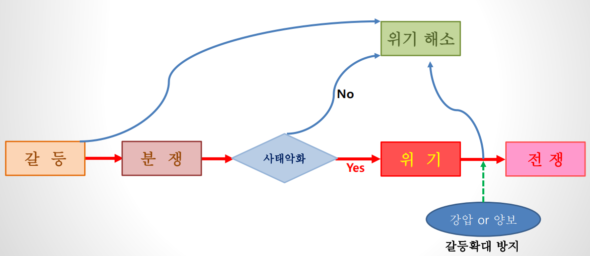
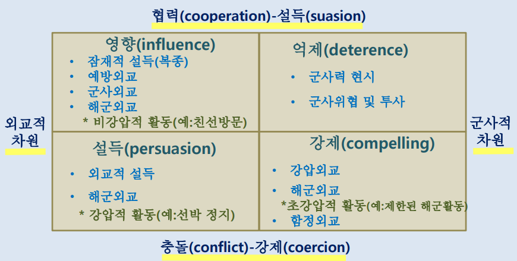

# W3, 국가의 기원과 성격
국가의 모습 형성 및 본질
국가의 구성요소
국가의 구성요소와 국가안보와의 관계
국가의 형태와 국가안보의 관계
국가의 본질, 국가의 구성요소와 국가안보와의 관계

옵저버 국가: 특정 국제기구나 국제연합에서 정회원국이 아니지만 회의에 참석하고 일부 권한을 부여받아 활동할 수 있는 국가
   - 정회원국이 아님
   - 회의에는 참석하나 의사결정 배제
   - 외교적 상징성
   - e.g. 팔레스타인, 바티칸 시국
## 근대국가의 성립과 발전
시대 구분: 고대, 중세, 근세, 근대, 현대
  - 고대: 서로마 멸망까지(~476년)
  - 중세: 유럽에 기독교 보급. 교황, 국왕, 제후의 세력 대립(한국은 고려시대)
  - 근세: 국왕과 부르주아가 주도(르네상스, 대항해시대-식민지 개척), 국내 시장 통일 / 법체계 정비 / 상거래(한국은 조선시대)
  - 근대: 산업혁명, 부르주아가 시민 혁명(프랑스 혁명, 1789) 및 왕권타도(한국은 조선시대)
  - 현대: 1차 세계대전 종료 이후
### 국가의 개념
국가: 최고 권위를 가진 제도
  - 플라톤: 고립된 삶보다는 공동의 국가에서 삶에 필요한 다양한 요소를 쉽게 공급받을 수 있기 때문에 폴리스 구성
  - 홉스: 인간이 강력한 법률과 제도를 갖춘 국가제도 속에서 사는 것이 궁극적으로 안전과 복지를 위하는 길
- 국가: 일정한 공동체 영역에서 주권을 구현하는 조직
- 주권: 특정 공동체를 통치하는 최고권력(보댕)
- 민족: 정치적, 문화적 동질성을 공유하는 사람들의 집단
- 민족국가 수립 계기: 1648년도 웨스트팔리아(베스트팔렌) 조약(30년 전쟁), 1918년도 민족자결주의(윌슨)
  - 1900년도에는 약 60개국 존재, 현재는 UN 회원국 193개 + 옵저버국 2
### 국가의 기원
  - 실력설(force theory): 한 종족이 다른 종족을 또는 같은 종족 내 한 계급이 다른 계급에 대한 실력적 지배
  - 재산설(property theory): 재산 즉 토지 사유권이 인정되면서 국가 발생
  - 족부권설(patriarchal theory): 가족 내 가부장의 권위가 확립되며 국가가 발생. 고대의 일부일처제 가족 단계, 고대문명 발생 시점의 국가
  - 계급설(class theory): 마르크스/레닌/엥겔스 등에 의해 주장. 원시 공동체 사회(사유재산제)의 빈곤계급과 부유계급 간 분화로 인해 국가가 발생. 지배계급이 다른 계급을 억압하고 재산을 유지하기 위한 수단으로 만들어 낸 통제기구
  - 신의설(divine right theory): 국가는 신이 창조한 것 or 신의 명령에 의해 만들어진 것
    - e.g. 루이14세 - 짐이 곧 국가다
    - 신학적 국가론: 국가 성립의 기초를 신의 뜻에 두고 국민에게 절대복종 강요
    - 고대 농경사회에서 건국신화로 종종 등장. 집권들의 통치수단으로 활용되었음
  - 사회계약설(contract theory): 국가 권력이 사람과 사람 간 계약에서 발생. 국가의 원천인 인간을 바라보는 인간관에서 출발
    - 토마스 홉스(1588~1679): 만인에 의한 만인의 투쟁. 공멸 방지를 위해 개인은 공권력을 만드는 계약을 해야 함. 강력한 국가에 대한 \[리바이어던\] 집필
    - 존 로크(1632~1704): 평화롭지만 자연권이 침해 가능한 불확실한 상태. 공권력을 인정하고 개인 저항권 소유. 국가 권력은 시민에게, 권력 박탈할 수 있는 혁명권
    - 루소(1712~1778): 인간은 자유롭고 평화로우나 자연권이 침해될 가능성. 사회계약에 의해 성립된 법과 제도가 오히려 다수의 인민을 억압하는 도구가 됨. 인민 주권론(자유/평등을 최대 확보, 공동이익을 위한 개인간 약속)
    <table style="text-align: center">
      <thead>
      <tr>
        <th>구분</th>
        <th>홉스</th>
        <th>로크</th>
        <th>루소</th>
      </tr>
      </thead>
      <tbody>
      <tr>
        <th>공통점</th>
        <td colspan="3">자연상태의 불완전함을 충족시키기 위해 국가의 지배를 인정하는 계약을 맺음. 국가권력은 시민들의 계약에서 유래</td>
      </tr>
      <tr>
        <th>자연상태</th>
        <td>만인의, 만인에 의한 투쟁</td>
        <td>평화롭지만 자연권이 침해될 수 있는 불확실한 상태</td>
        <td>인간은 자유롭고 평등하나 자연권이 침해될 가능성</td>
      </tr>
      <tr>
        <th>주권</th>
        <td>군주 주권</td>
        <td colspan="2">국민 주권</td>
      </tr>
      <tr>
        <th>정치 형태</th>
        <td>전제군주정</td>
        <td>간접민주제, 입헌군주제</td>
        <td>공화정, 직접민주제</td>
      </tr>
      </tbody>
    </table>

### 근대 국가의 등장
중세기: 수 개의 왕국이 종교적 질서에 의해 유지, 30년 전쟁
1648년 베스트팔렌(웨스트팔리아) 조약: 135개 공국
   - 30년 전쟁 이후 유럽 근대 국가의 기초 마련 - 영토, 국민, 주권
   - 유럽 공국들이 '주권' 원칙 수립, 국가와 종교 분리 정착
   - 절대주의 왕건 수립 -> 권력 집중, 정치적 공동체 및 국가 형성에 기여
     - 영토적 경계, 표준 군대의 도입, 외교와 외교적 제도 하의 국가 간의 관계 형성

### 유럽의 팽창과 국가의 팽창
 - 식민지 쟁탈전 시작
   - 19세기 말 영국의 식민지 독점, 열강에 의한 세계 분할 - 1차 세계대전의 원인
     - 지리상의 발견(15세기), 스페인-포르투갈(16세기), 네덜란드(17세기), 영국-프랑스(18세기)
   - 식민지 개척의 유럽 팽창 -> 유ㄹ버 이외 지역 정치공동체의 국가-민족 관심 촉진
 - 제1차 세계대전 이후
   - 식민지에서 민족자결주의 사상 고조, 러시아 혁명 이후 민족해방운동 격화
   - 국제연맹 창설: 1차 세계대전 전승국 + 초청국 등 42개국이 전부였음
 - 제2차 세계대전 이후
   - 국제연합 창설: 최초 회원국은 51개에 불과, 이후 193개국으로 증가
   - 새로운 국가 탄생의 물결
     - 2차 세계대전 패전국들의 식민지 독립
     - 아시아-아프리카의 시대: 비동맹 세력, 2차 세계대전 승전국들의 식민지 독립
     - 탈냉전 이후, 구소련 및 구유고슬라이바 해체로 인한 독립

### 민주주의 국가의 팽창
 - 계몽주의 사상의 영향
   - 미국의 독립, 프랑스 혁명, 영국-아일랜드-독일-헝가리 등 전 유럽에 영향
   - 국민이 주인 되는 민주주의 등장
 - 민주주의로의 정치 변동
   - 헌팅턴(Samuel P. Huntington)의 "The Third Wave"
     - 1828~1926: 미-영-프 및 기타 해외 영국 지배국가의 민주화
     - 1943~1962: 서독-이태리-인도-일본-이스라엘 민주화
     - 1970s: 포르투갈-스페인, 라틴 아메리카, 아프리카, 아시아 민주화
   - "The 4th Wave": 탈냉전 이후 러시아, 동구, 구소련 공화국들의 민주화
   - 후쿠야마(Francis Fukuyama)의 '역사의 종언': 민주주의의 세계화 현상
   - "The 5th wave": 2010년 12월 쟈스민 혁명(튀니지), 이집트-리비아-예멘-시리아
 
### 자유주의 국가론
 - 태동: 절대군주제에 반발, 부르주아 지배계급의 이익을 정당화하고 지켜주기 위함. 절대왕권 체제 타파의 이념적/현실적 힘을 제공
 - 개념 및 논리
   - 사회의 공공선을 달성하는 사회적 제도로서 국가를 상정
   - 시장에 간섭하는 국가의 권력은 최소화되어야 함
   - 단, 국가는 전쟁억제와 공공안녕 질서유지의 최소한의 역할 담당
   - 민주공화제, 의원내각제, 입헌군주제, 대통령 중심제 등
   - 본질: 부르주아가 국가권력 장악, 지배세력이 되는 국가 형태를 기본 골격으로

### 다원주의 국가론
 - 태동: 제2차 세계대전 이후, 1950~60년대 미 정치학의 주류. 정치권력을 여러 집단, 파벌 등에 분산
 - 개념 및 논리
   - 국가: 집단 간 공동 이익을 추구하는 제도, 사회 내 대립되는 세력들 간 화해의 산물, 대립적 사회세력의 가치중립자로서 역할
   - 국가란 집단의 이익을 달성하기 위해 이용할 수 있는 중립적 도구에 불과
   - 단, 국가는 중개자 또는 심판의 역할 담당, 전통적 국가관에 반대
   - 집단 간 타협과 조정을 전제로 함(이익단체, 압력단체, 시민단체, 공익단체 등)
   - 한계: 갈등 심화, 군소집단의 이익 배제, 로비활동/매수공작 등 정치적 부패 우려

### 조합주의 국가론
 - 태동: 다원주의 국가론의 한계를 인식하고 변형된 형태. 다원론은 국가가 집단 간 타협/조정 정책을 집행하여 국가가 적극적으로 관여 및 주도
 - 개념 및 논리
   - 국가는 자원배분권을 이익집단과 공유하며 이익집단의 관계는 보호자-고객관계로 정형화, 국가는 규제자적 역할 수행
   - 사회조합주의 & 국가조합주의
     - 사회조합주의: 자본가와 노동자의 대등관계 유지 및 보장. 스웨덴, 핀란드 등 북구
     - 국가조합주의: 독점자본과 국가를 연계하여 노동세력을 통제. 칠레, 멕시코 등 남미
   - 어떤 집단보다도 국가가 주도적/능동적 역할 수행, 국가 주도의 복지정책 설명

### 계급주의 국가론
 - 태동: 19세기 중엽 이후, 서구 자본주의 경제 모순이 누적됨. 마르크스, 엥겔스 등
 - 개념 및 논리
   - 국가는 사회경제적 지배계급이 피지배계급을 억압, 착휘하기 위한 조직, 기구, 도구일 뿐이라고 인식
   - 국가가 자본가의 특권을 옹호하고 지배계급의 이익을 위해 봉사한다고 비판
   - 국가 또는 국가기구는 가치 중립적 존재가 아닌 지배계급 이익을 대변
   - 마르크스의 \[공산당선언\]
     - 국가소멸론: 자본주의 하에서 국가는 부르주아 계급의 이익을 위한 착취기구, 자본주의 사회에서 사회주의 및 공산주의로 진행함에 따라 국가는 소멸

### 자율국가론
 - 태동: 막스 베버(Max Weber)와 같은 사회학자들이 주장. 국가는 일정한 영토 내에서 물리적 강제력을 합법적으로 행사하는 인간공동체
 - 개념 및 논리
   - 국가: 스스로의 목표와 그것을 실현할 수 있는 능력을 갖춘 자율적 행위자
   - 국가의 특성: 영토성, 물리적 힘의 독점, 정당성
   - 국가는 사회공동체와 국가 자신의 이익을 추구하는 의지적 행위자, 절대적 지배권을 향유하는 초계급적 실체
   - 사회 내에서 국가의 우월한 위치를 확보시켜주는 결정적 요인은 관료제
     - 기술적 우월성, 전문적 지식과 정보, 비밀 보장 등의 이점. 산업 사회의 필수조직
     - 상비군, 직업공무원을 통해 국가통치권 전담

### 관료적 권위주의 국가론
 - 태동: 1960년대 남미에서 군부쿠데타를 통해 나타난 권위주의 체제 등장에 근거함. 오도넬(Guillermo A. O' Donnell)에 의해 제시
 - 개념 및 논리
   - 라틴 아메리카의 자본주의 체제 유지를 위한 국가의 적극적 활동이라는 명분
   - 주요 사회적 기반 및 비중: 상부 자본가 계층, 군부, 관료 등
   - 미중부문 통제 강화 -> 민주주의 제도 폐지 -> 소수 대기업 및 국가기관에 과도한 경제적 특혜 부여, 자본 축적 도모
   - 생산구조의 국제화, 탈민족화, 사회문제의 탈정치화, 질서 및 경제 정상화 강조 -> 민중적, 계급적 이익 대변 통로 차단

## 국가의 권리
| 권리       | 설명                                                                                                                              |
| ---------- | --------------------------------------------------------------------------------------------------------------------------------- |
| 독립권     | 국내문제, 외교관계에 외국 간섭 없이 독립하여 주권행사 권리(불간섭의 원칙)                                                         |
| 평등권     | 차별 없이 평등한 권리와 의무 보유                                                                                                 |
| 불가침권   | 국제법상 한 국가가 타국의 영역, 국민, 주권 침해는 불법행위 불가침권 침해 행위 방지 의무, 자위권 행사 권리                      |
| 명예권     | 국가 대표자(대사/영사, 주재 무관), 거주지(대사관/영사관), 부속시설, 친선/교육 목적으로 방문하는 항공기, 군함/승무원에 명예권 부여 |
| 외교교섭권 | 주권국가로서 외국과 외교교섭할 권리. 평화적 방향으로 국가 간 갈등 해결(국가 간 조약 체결, 분쟁 해결)                              |

## 국가의 구성요소
국가는 국민, 영토, 주권으로 구성
   - 옐리네크(Jellinek): 국민, 영토, 정부
   - 부잔(Buzan): 물리적 기반, 제도, 이념
     - 물리적 기반(국민, 영토), 제도(조직, 규범, 법률)
     - 이념(국가의 정통성을 기초로 한 정체성)
### 영토
영토: 국가가 지배력을 미칠 수 있는 영역. 육지와 섬 등 토지로 성립하는 국가 영역
 - 기준: 영수, 영해, 영공
   - 국가 영역중 가장 핵심적인 부분이자 물리적 실체
 - 섬 영토의 한계: 밀물 때 물 위에 나온 부분
 - 영해의 범위: 12해리(모든 인류의 공동소유 개념. 과거에는 3해리(해안포 사거리)). UN 해양법 회의를 통해 1982년도에 법적 장치를 마련

영해
 - 선박의 공해상 통항 자유(공해자유의 원칙)
 - 타국 영해
   - 연안국가의 평화, 질서, 안전 유지 하에 외국 선박 무해통항권을 인정함
   - 군함, 잠수함이 타국 영해 통항 시 연안국의 허가 필요 - 해면상 항해 및 국기게양
   - 타국 영해 무단 항해 시 영해 침범 행위로 간주하고 경고, 정선, 나포, 격침
 - 영토의 국제법상 지위
   - 매매: 1803년 미국의 프랑스령 루이지애나(1500만불), 1867년 러시아령 알래스카(720만불)
   - 교환: 이스라엘-팔레스타인, 키르기스스탄-카자흐스탄
   - 증여: 1954년 러시아-우크라이나 합병 300주년 기념, 크림반도 양도
   - 조차: 홍콩, 관타나모, 파나마운하 지구, 니콰라콰 콘 제도 등
   - 임차: 북한의 라선특별시(2012년도에 중국에 50년간 임차)
### 국민
국민: 국법의 지배를 받는 국가의 구성원
   - 영토 내 뿐 아니라 재외국민처럼 영토 외에서도 주거 가능
   - 종족 또는 민족과 반드시 일치하진 않음
 - Nation: 법적 개념은 국민, 사회학적 개념은 민족, 법/정치/사회적 개념은 국가를 의미
 - 민족 국가(Nation State): 국민 국가의 근원이 민족국가에 있음을 의미
   - 민족 영역과 국가 영역이 비교적 일치하는 국가
   - 혈연적 근친 의식에 바탕
   - 공동의 사회, 경제 생활 영위
   - 동일한 언어, 문화, 전통적 심리 바탕: 인간공동체
   - 유럽에서 프랑스 혁명, 나폴레옹 전쟁 이후 본격적 등장
   - e.g. 일본, 이탈리아, 헝가리
 - 국가 민족(State-nation) 국가: 영역 만이 존재하고 민족의 의미가 약한 국가 모형
   - 미국, 호주, 중남미 등
 - 부분민족 국가(part nation state): 한 민족이 둘 이상으로 나눠져 다른 국가를 형성
   - 한국, 중국, (구)베트남
 - 민족-국가의 6가지 형태
   - 한민족-한국가: 헝가리, 폴란드, 이태리, 일본 등
   - 다민족-한국가: 중국, 러시아, 구유고 등
   - 한민족-다국가: 한국과 북한, 중국과 대만 등
   - 다민족-다국가: 르완다, 부룬디
   - 한민족-무국가: 식민지, 집시, 쿠르드족 등
   - 한국가-한국민: 미국, 호주, 캐나다 등
     - 국가가 선형성, 민족이 후형성

### 주권(Sovereignty)
주권은 국가 권력의 대내적 최고성, 대외적 자주/독립성을 의미
   - 상위의 어떤 정치적 권위도 거부
   - 영토와 국민에 대해 치ㅗ고의 정책결정 권위를 국가가 합법적으로 가지는 것
 - 대내적 주권: 국가 이념, 법, 제도를 외부 간섭 없이 제정할 수 있는 권리
   - 국가 이념과 국민이 지향하는 이념이 다를 경우 안보문제 발생
   - 인접국가의 이념도 자국 안보에 영향을 줌
 - 대외적 주권: 자주적, 독립적으로 대외관계를 결정할 수 있는 권리
   - 외교관계 수립, 국제기구 또는 국제레짐 가입, 동맹 체결 등을 스스로 결정
 - 국가주권의 불평등
   - UN 안전보장이사회의 구성, 거부권 사례
   - UN 총회 결정사항의 강제력 미보유

### 국가의 형태
국가의 형태는 아래와 같은 분류 기준
   - 국가의 크기, 위치, 인구, 자원, 이념, 종교, 민족 등
   - 정치적 결속력, 경제력, 사회적 연대감 등
     - 개별 국가 분류 시, 해당 국가의 위협 및 취약성 도출 가능
 - 강대국 vs 약소국(strong power vs weak power)
   - 구분 기준: 군사력과 경제력
   - 예외: 군사력이 약하고 경제력이 강한 캐나다 및 호주, 경제력이 약하고 군사력이 강한 북한 및 파키스탄
   - 국가안보와의 관계:
     - 강대국: 내외부적 위협이 적고 대비 수단이 다양 -> 취약성이 적음
     - 약소국: 내외부적 위협이 많고 대비 수단이 적음 -> 취약성이 높음
 - 강건한 국가(strong state) vs 연약한 국가(weak state)
   - 구분 기준: 정치/사회적 결속력
   - 연약한 국가의 정치/사회적 현상
      1. 국민에 대한 높은 수준의 정치적 폭력, 국민 무저항
      2. 국민에 대한 높은 수준의 정치적 폭력, 국민 저항
      3. 정치제도의 정상적 작동 제한
      4. 국민들 간 이념적 연대감 제한
      5. 국민들 간 민족적 정체성 분열
      <table border="1" style="text-align: center">
      <thead>
        <tr>
          <th rowspan="2" colspan="2">구분</th>
          <th colspan="2">정치/사회적 응집력</th>
        </tr>
        <tr>
          <th>weak state</th>
          <th>strong state</th>
        </tr>
      </thead>
      <tbody>
        <tr>
          <th rowspan="2">힘의 크기</th>
          <th>weak</th>
          <td>대부분 유형의 위협에 취약</td>
          <td>특히, 군사적 위협에 취약</td>
        </tr>
        <tr>
          <th>strong</th>
          <td>정치/사회적 위협에 취약</td>
          <td>대부분 유형의 위엽에 상대적으로 비취약</td>
        </tr>
      </tbody>
      </table>

# W4, 국가안보의 이해
국가의 개념과 이에 따른 안보의 함의
국가이익과 국가안보의 상관관계
국가이익의 세분화
탈냉전 이후 국가안보 개념이 안보의 주체/영역/방식 측면에서 변화

## 국가안보와 경제안보
| 구분                      | 결과                                 |
| ------------------------- | ------------------------------------ |
| 한국, 일본                | 강한 국가안보는 경제성장을 뒷받침    |
| 소련붕괴, 우크라이나 전쟁 | 경제적 불안정은 국가안보 위기를 초래 |
| 중국 일대일로             | 경제력을 활용한 국가안보 전략        |
### 한, 일
- 대한민국: 1960~70년대 중화학공업 육성, 방위산업과 경제 발전. 방위산업 육성이 자주국방력 강화와 수출산업을 발전
- 일본: 미국와의 안보협력으로 경제 재건에 집중. 군사비를 최소화하고 경제성장으로 세계 2위 경제대국 등극(1970~80)
- 소련붕괴: 1980 미 레이건 대통령이 군사력 증강 -> 소련과 군비 경쟁 초래 -> 소련의 무리한 군사비 지출, 경제 붕괴
- 우크라이나 전쟁: 러시아산 원유에 의존하던 유럽의 에너지 가격 폭등, 전세계 영향. 우크라이나의 곡물 수출이 막히면서 곡물 가격 급등
- 중국(일대일로): 여러 국가에 차관을 제공해 경제 의존도 증가, 이 대신 중국 군사기지 건설(스리랑카 함반토타 항구, 아프리카 지부티 군사기지 등). 미/유럽, 중국의 경제/안보 패권 전략으로 간주, 미중 무역전쟁 초래 => 경제력을 이용한 국가안보전략 추구 사례
- 미국의 군사개입 배경
  - 국가안보(정치) - 경제안보(경제)가 하나로 연계된 외교정책의 예시
  - 중동 1차 오일쇼크(1973)로 미국의 정치, 경제 타격
  - 소련의 아프간 침공으로 미국의 사활적 이익에 대한 위협
  - 이라크의 쿠웨이트 점령, 사우디 동부 침공 기도 첩보
  - 이라크의 아랍 석유 통제 저지(에너지 수급의 안정성 확보를 위해)
## 국력
국력: 한 국가가 가진 혹은 동원할 수 있는 인적/물적/기타 자원들로, 실제 행동으로 옮겨 다른 국가의 행동을 변화할 수 있는 국가의 능력
### 국력의 성격
1. 공격적 힘 vs 방어적 힘
2. 잠재적 힘 vs 실제적 힘
3. 평시(평화 시의 힘) vs 전시의 힘

### 국력의 구성요소
<table style="text-align: center">
  <thead>
    <tr>
      <th colspan="3" style="text-align: center">자연적 요소</th>
      <th colspan="2" style="text-align: center">경제/군사적 요소</th>
      <th colspan="2" style="text-align: center">정치/정보적 요소</th>
      <th>심리적 요소</th>
    </tr>
  </thead>
  <tbody>
    <tr>
      <td>지리</td>
      <td>인구</td>
      <td>천연자원</td>
      <td>경제</td>
      <td>군사</td>
      <td>정치</td>
      <td>정보</td>
      <td>심리</td> 
    </tr>
  </tbody>
</table>

- 지리
   - 위치: 국가의 외교정책과 밀접한 관계(독-러 사이의 폴란드)
     - 지정학적 논쟁: 나치 독일의 생활권, 일본의 대동아 공영권, 러시아의 부동항 개척, 미국의 해외기지 건설, 좁은 해협에 대한 통제 등
   - 기후: 가난한 국가들은 대부분 극지방or적도지방
   - 규모: 구소련(외세 침략 시 시간과 공간을 교환)
   - 지형: 산악or평지, 밀림or사막
- 인구
   - 규모, 성장과 감소의 경향, 구조(노동인구, 노령인구)
- 천연자원
   - 국력의 원천은 (자원의 물리적 보유) + (개발 능력) + (분배에 대한 정치적 통제 능력)
   - 희귀 자원을 둘렀나 분쟁(해저개발 경쟁, 극지방 개발 경쟁 등)
   - 대체자원 개발(기술적 경쟁): 녹색 기술 경쟁
- 경제
  - 강력한 국내 경제는 국제 정치에서 영향력 행사 가능
  - 군사적 투자
  - 국가경제가 국제무역과 재정시장에 의존 시 자율성 축소 -> 이에 따른 취약성
- 군사
  - 전통적 국력 측정 도구
  - 인력/장비/무기 뿐 아니라 리더십/사기/군기 등도 중요 요소임
  - 국력의 투사능력과 지속성(미국), 동원 능력(이스라엘, 스웨덴)의 중요성
- 정치
  - 정부의 형태 - 전제국가, 민주국가
  - 정부 형태에 대한 국민들의 태도
  - 정부의 효율성
- 정보
  - 정보 지배: 전투공간 인식, 지휘통제 향상, 정밀한 군사력 통합 -> 시너지 효과
  - 사이버전: 군사적 대상, 행정 및 민간 산업 부문을 목표
  - 정보통신기술의 비약적 발전은 양날의 검
- 심리
  - 국가적 의지와 사기(e.g. 모택동/간디/호메이니, 월남전, 걸프전 이라크군)
  - 국가의 성격: 특정 정책과 전략의 선호성과 관련
    - 미국: 윌슨의 이상주의, 미국 피격 후 참전 / 9.11 이후 국가성격 변화
    - 러시아: 서구로부터 침략 경험, 공산주의 통치, 기후 관련 금욕주의적 가치
  - 국가 통합 수준: 국민의 소속감과 정체성에 영향
    - 민족, 종료, 언어, 문화적 동질성 정도와 직접적 상호연계성
### 국력 평가
국력은 역동적/관계적인 속성을 가지며 잠재적/현재적으로 급속히 변화 => 평가하기 어려움
  - 평가 시 유의사항
    - 다차원적 상호 연계성 고려: 군사력 하나로 국력이 결정되지는 않음
    - 국력의 상대성 고려: 국력은 한 국가와 비교된 상대방의 질로부터 표출
    - 국력의 역동성: 세력균형 변경 요소

## 국가안보
안보의 어원은 라틴어 `Securitas`로, 근심/걱정이 없는 자유, 안전 및 위험의 부재 상태
국가안보: **안전보장의 준말**로, 국가가 공포/불안/걱정이 없는 상태.
  - 핵심 가치인 영토, 국민, 주권을 외부의 위협으로부터 보호 및 유지
  - 대내외적 위협으로부터 국가가 추구하는 가치와 이익을 보호 및 증진하는 것
    - 모겐소(Morgenthau): 영토와 국가제도의 통합성이 유지되는 것
    - 버코비츠&보트(Berkowiz&Bock): 외부의 위협으로부터 국가의 내적 가치들을 보호할 수 있는 능력
    - 울퍼스(Wolfers): 객관적 의미에서 획득된 가치에 대한 위협의 부재, 주관적 의미에서 그러한 가치가 공격받을 두려움이 없는 상태 => **객관적 안보**
    - 볼드윈(Boldwin): 인위적 위험과 비인위적 위협으로부터 인간의 제 가치를 보호하는 것
    - 광의vs협의
      - 협의: 외부의 군사적 위협에 대한 국가 안전보장
      - 광의: 군사적 위협과 더불어 인간 및 환경 위협에 대한 안보를 포괄
    - 냉전기vs탈냉전기
      - 냉전기: 주로 군사적 위협
      - 탈냉전기: 위협이 다양화되고 포괄적으로 변화
        - e.g. 군사안보, 경제안보, 정치안보, 환경안보 등
  - 분류: 영역, 유형
    - 안보영역: 군사안보, 경제안보, 정치안보, 환경안보
    - 안보유형: 집단안보, 포괄적안보, 공동안보, 협력안보
  - 경제안보: 국가안보의 수단으로서 경제력을 대상으로 함
    - 한 나라의 경제력이 군사력을 뒷받침할 수 있는 충분한 잠재력을 가진 것
    - 경제적 위협의 결과가 경제 분야에 국한되지 않고 정치, 군사적 분야에 크게 영향을 미치면 국가안보 문제로 확대 가능
      - 국력 수준의 심각한 저하를 초래하는 위협

|             |       |                                  |       |          |
| :---------: | :---: | :------------------------------: | :---: | :------: |
|             |       |             국가목적             |       |          |
|             |       |                ↓                 |       |          |
|             |       | 국가목표(국가목적의 구체적 표현) |       |          |
| 국가이익(★) |   →   |                ↓                 |       |          |
|             |       |             국가정책             |       |          |
|             |       |                ↓                 |       |          |
|             |       |         국가안보정책(★)          |       |          |
|             |   ↙   |                ↓                 |   ↘   |          |
|  외교정책   |       |             군사정책             |       | 경제정책 |
|             |       |                │                 |       |          |
|      ┌      |   ─   |     ───────────┴───────────      |   ─   |    ┐     |
|      ↓      |       |                                  |       |    ↓     |
|   군구조    |       |                                  |       | 군사전략 |
### 국가목적
- 국가목적: 국민의 영속적인 염원인 안전/발전/복지
- 국가의 도전 요소: 영토분쟁(분리운동 포함), 정부 장악을 위한 분쟁, 경제적 분쟁(무역/통화/천연자원/마약), 종족-민족 분쟁, 종교분쟁, 이념분쟁
### 국가이익
- 국가목표: 국가 존재 의의, 가치를 공고히 하거나 향상하는 것을 국가발전으로 간주. 국가의 안보, 번영 등
  - 국가목표는 안보정책 결정의 주요한 요소로, 국가 이익으로 구체화됨
  - 1961~63: 반공국시, 경제성장
  - ~69: 정치적 독립, 경제적 자유, 사회적 안정
  - ~72: 경제성장, 국가안보
  - 80s: 복지사회 건설, 민주주의 토착화, 정의사회 구현
- 국가이익: 국민의 영속적 국가목적을 추구하고 국가목표를 달성하기 위해 국력을 집중하고 노력하는 가치기준

  | 학자               | 국가 이익 정의                                                                                                              |
  | ------------------ | --------------------------------------------------------------------------------------------------------------------------- |
  | C.A Beard          | 경제적 이익 개념에서 국가이익 개념으로 확대 사용. 국가가 유지되고 부강해질 수 있는 기준과 방식’으로 정의                 |
  | Hans J, Morgenthau | 국가의 생존이 최소한의 국가이익, 힘으로 정의된 국가이익이 국가목표가 되고 국가목표가 국가정책의 최선의 기준이자 이해의 척도 |
  | Rogert E, Osgood   | 한 나라의 최고 정책 결정 과정을 통하여 표현되는 국민의 정치적/사회적/문화적/군사적 욕구의 갈망                              |
  | F, Hernz           | 국가의 존립과 발전을 위해 필요한 국민의 열망 3대 요소는 국가안전보장, 국가복지 번영 보장, 국가 위신 보장                    |

  - 국가이익 예시
    - 한국
      1. 국가안전보장
      2. 자유민주주의와 인권 신장
      3. 경제발전과 복리증진
      4. 한반도의 평화적 통일
      5. 세계평화와 인류공영 기여
    - 미국
      1. 미국 본토와 해외 주둔 미군에 대한 대량살상무기 공격 예방
      2. 동맹국의 협력을 통해 미국이 번영 가능한 국제질서 구축
      3. 적대적 강대국 부상과 실패한 국가 등장을 예방
      4. 교역/금융/환경/에너지 공급 등과 관련된 국제질서 안정 및 유지
      5. 중, 러 등 잠재적 적국과 생산적 관계 유지
  - 국가이익의 분류
    - 생존적 이익: 국가 생존과 관련
    - 사활적 이익: 국가 안전 또는 동맹국 안전과 관련(경계는 군사력 동원 여부)
      - 국가 존립에 관한 이익. 국민들의 생활을 보장/증진하는 데에 필수적(영토, 주권 등)
    - 중요한 이익: 국가의 해외 자산, 중요 천연자원 접근과 관련
    - 주변적 이익: 해외 자국민의 기업이익, 자국민의 안전과 관련
  - 전통적/비전통적 안보 개념
    | 구분     | 냉전 시 안보 개념                             | 탈냉전 시 안보 개념       |
    | -------- | --------------------------------------------- | ------------------------- |
    | 안보주체 | 국가                                          | 국가/비국가               |
    | 안보영역 | 군사안보                                      | 포괄적 안보               |
    | 안보유형 | 절대안보 (적국을 희생함으로써 안보를 유지) | 집단/포괄적/공동/협력안보 |

  - 안보주체: 비국가행위자(개인, 종족, 전통집단, 경제블록, 다국적기업, NGO(Booth) 등)가 추가됨
    1. 탈냉전 후 개별국가가 홀로 대응하기 힘든 범국가, 비군사적 문제가 등장(국제테러, 대량살상무기, 지구환경, 초국가적 조직범죄, 국제금융위기 등) -> 문제 해결을 위해 국가 간 협력 및 상호의존 심화
    2. 정보혁명 및 세계화
    - 사례: 지역안보협력체(ARF, APEC, ASEM, 6자회담 등)
  - 안보영역: 군사안보, 경제안보, 정치안보, 환경안보
    - 군사안보: 국가안보의 하위요소 + 중심축. 국내외적 군사적 위협으로부터 국가의 가치 및 이익을 보호 및 증진
    - 경제안보: 국가 경제와 국민 생활이 위태롭게 되는 상황 극복. 군사안보와의 관계 관점에서 독립적 개념으로 분화. 공급, 시장접근성, 기술산업능력, 금융신용 등
    - 정치안보: 정치체제 및 정치 이데올로기를 국내외 위협과 도전으로부터 보존. 안정적 통치를 통해 국가안보 달성. 한 국가의 통치 엘리트가 통치에 대한 폭력적 도전으로부터 안전한 상태
    - 환경안보: 환경문제가 국가안보를 위협할 수 있음. 생태계 변화, 자원수급 실패, 기후변화, 질병 등의 위협에서 국가 이익 및 가치 보호
  - 안보유형: 집단안보 -> 포괄적 안보 -> 공동안보 -> 협력안보
    - 집단안보: 다수의 국가가 군사 동맹 조약과 같은 형식을 취해 공동으로 방위 조직을 만들어 상호 안전을 보장하는 정책. UN 등
    - 포괄적 안보: 군사적 안보위주의 전통적인 안보개념에서 핵, 테러, 마약 등 비전통적 안보위협에 대응해야 한다는 안보개념
    - 공동안보: 안보를 '공동의 문제'로 보고 진영 간 신뢰구축, 이해증진, 나아가 군축을 통해 안보를 더불어 도모
    - 협력안보: 냉전 후 이념 대립이 해소되어 적군/아군을 특정할 수 없는 세계에서 잠재적 위협이 현재화하지 않도록 모든 관계국이 협력하고 대화하여 안전보장환경 개선 도모 
  

## 국가안보 연구 패러다임
현실주의, 자유주의, 구성주의
### 현실주의
- 국제체제를 무정부상태로 간주, 힘의 위계질서만 존재
- 국가의 가장 소중한 가치는 안보, 핵심적 수단은 국력
- 군사력을 국력의 가장 중요한 구성요소로 인식
- 특징:
  - 국가 간 경쟁의 원인은 인간의 본성(지배욕)
  - 영토보전, 국민보호, 주권유지 등의 안보를 최우선 국가목표로.
  - 국가를 국제관계에서 가장 중요한 행위자로 인정, 비국가행위자 비인정
  - 국가도덕은 개인적, 보편적 도덕과 달라 국가 스스로 생존을 위해 노력해야 함
### 자유주의
- 국제관계를 인식, 국가들 사이에 조화/협력이 존재한다고 가정
- 전쟁의 원인을 근원적으로 제거하기 위한 공동의 노력 경주
- 국제기구/국제법/세계정부와 같은 제도를 통해 국가 간 상호작용 가능
- 특징:
  - 인간의 본성을 선하다고 인식
  - 서로를 적이 아닌 평화와 복지를 위한 파트너로 가정, 국제관계 중요시
  - 국제체제에서 국가 뿐 아니라 비국가행위자 인정
### 구성주의
- Wendt, 현실주의 비판에서 출발
  - 국제사회의 무정부 상태가 어떤 특징을 띄는지는 국가 스스로가 만듬(Anarchy is what states make of it)
  - 구조에 속한 행위자의 역사적 경험, 행위자-행위자, 행위자-구조로 구성
    - 국제정치의 내용은 국가 간 믿음과 기대에 의해, 이것은 사회적 구조에 의해 결정
      - e.g. 핵무기를 영국이 500, 북한이 5개 보유 가정 => 미국은 북한에 더 위협을 느낌
    - 개체에 해당하는 국가가 구조에 해당하는 국제체계와 영향을 주고받으며 국가 정체성이 변화함
    - 현실주의, 자유주의는 냉전의 종결(소련의 정체성 변화 등)을 설명하지 못함

| 구분     | 현실주의                            | 자유주의                         | 구성주의                           |
| -------- | ----------------------------------- | -------------------------------- | ---------------------------------- |
| 국제관계 | 무정부                              | 상호의존                         | 상호 구성                          |
| 핵심관심 | 국가이익                            | 개인/지구적 이익                 | 문화/제도                          |
| 협력관계 | 부정적, 배반 우려, 상대적 이익 중시 | 긍정적, 절대적 이익 중시         | 사회적 정체성에 따라 협력          |
| 안보중점 | 취약성 감소                         | 위협 감소                        | 위협/취약성 감소                   |
| 안보대안 | 자주국방, 동맹, 세력균형            | 국제법, 집단안보, 군비통제, 통합 | 문화적 기반 확장, 집합 정체성 구축 |

# W5, 전쟁과 군사력
전쟁의 정의, 유형, 본질
전쟁양상의 변천
군사력의 개념, 기능, 종류
군정과 군령
군사안보의 중요요소

## 전쟁
- 전쟁: 군사력에 의한 국가 간 또는 국가와 교전단체 간 투쟁행위
  - 클라우제비츠: 전쟁은 다른 수단에 의해 수행되는 정치의 연장에 불과
  - 전쟁은 다른 투쟁형태인 외교/경제적 압력, 간섭/무력에 의한 위협, 소규모 무력행사보다 전면적이고 포괄적
  - 전쟁은 국가 뿐만 아니라 국가집단 및 내란의 정치단체(교전단체 인정 시)도 주체가 될 수 있음
- 역사적으로 전쟁은 약 92%의 기간 동안 지속, 8%만 평화
  - BC 3000 ~ AD 1950 간 전쟁이 없던 기간은 292년(노먼 커즌스)
  - 1945~90: 45년 간 전쟁이 없던 기간은 3주(앨빈 토플러)
- 전쟁의 기능: 전통적으로 영토/인구/경제력 획득 및 외부침략으로부터 보호
- 전쟁의 원인: 개인수준, 국내 정치수준, 국제체제적 수준, 전 지구적 수준
  - 개인 수준: 국가 지도자들의 개인적 정책 결정. 합리적 결정(현실주의)/인지적 편견, 정보 여과, 전체 국민의 증오심, 민족주의, 종교. 문화성 등
  - 국내 정치수준(국가정치수준): 분쟁의 폭력적 성향을 낳는 국가사회적 특징
    - 이데올로기적 폭력성, 미눚주의 국가와 전체주의 국가 비교, 빈곤한 농업국가와 부유한 공업국가 비교, 호전성
  - 국제체제적 수준: 국제관계의 주요 행위자들 간의 힘의 관계
    - 힘의 전이이론: 패권국가의 지위가 위협받는 시기에 대규모 전쟁 발발
    - 억지이론과 군비경쟁이론의 상반성
  - 전지구적 수준: 대규모 전쟁은 주기적으로 발생
    - 기술 및 국제규범의 발달로 전쟁 가능성 감소
    - 100년 단위로 패권 국가가 등장했음(16C 스페인, 17C 네덜란드, 18C 프랑스, 19C 영국)
- 전쟁의 본질:
  - 전략가/학자 견해
    - 손자: 병자 국지대사 사생지지 존망지도 불가불찰야. 전쟁이란 국가의 큰일이며 죽음과 삶의 바탕이고 존속과 멸망의 길이니 살피지 않을 수 없다(손자병법 시계편)
    - 클라우제비츠: 전쟁이란 적을 굴복시켜 자기의 의지를 가용하기 위해 사용하는 일종의 폭력행위
  - 전쟁관:
    - 18세기 계몽주의, 전쟁의 원인을 절대왕정의 전제성에 기인한다는 인식(군주는 전쟁을 원하고 국민은 평화를 원한다)
    - 20세기, 침략전쟁을 불법화한 국제법규 제정(방어전쟁만이 합법, 침략전쟁과 분쟁해결 위한 무력사용은 불법)
- 전쟁 유형:
  - 국제법상 분류: 합법/위법적 전쟁
    - 합법적 전쟁: 불법적인 공격을 받은 국가가 자위를 위해서 수행하는 전쟁
    - 위법적 전쟁: 정당한 사유 없이 외국에 대하여 무력공격(==침략전쟁)
  - 공간에 의한 분류: 전면전/국지전
    - 전면전: 교전국가의 총자원이 동원되어 전쟁목적, 지역, 참가국가, 전쟁수단이 무제한적인 대규모 전쟁(총력전)
    - 국지전: 한정된 지역 내에서 이뤄진 전쟁. 관점에 따라 달라질 수 있음
      - e.g. 월남전은 세계적 시각에서는 국지전, 해당국에선 전면전
  - 시간에 의한 분류: 장기/단기/우발전
    - 장기전: 국력이 소모될 때까지 오랜 기간 진행되는 전쟁
    - 단기전: 수일 혹은 수주 만에 종료되는 전쟁
    - 우발전: 계획에 의한 전쟁이 아닌 우연한 계기로 발생하며 주로 단기간에 종료
  - 수단/목적에 따른 분류:
    - 수단/목적: 전면전/제한전, 절대전
    - 사용무기: 핵전쟁, 비핵전쟁, 재래식 전쟁
  - 기타
    - 정치적 목적/이념: 혁명/독립/해방/인민/제국주의/종교전쟁
    - 전쟁의 수단: 전자전, 게릴라전, 화학전, 생물학전, 정보전
- 전쟁 양상의 변천
  - 고대
    - 시대 배경: 인류가 집단생활을 시작한 뒤로부터 생존을 위한 전쟁
    - 본격적 전쟁은 국가 형성 이후
    - 목적: 삶에 필수적인 자원(비옥한 영토, 물, 식량) 확보 -> 종족 보존
    - 전쟁 양상
      - 동양: 중국 춘추전국시대엔 패권 쟁탈전, 통일 이후 변방국 정복전쟁
      - 서양: 그리스 도시국가에서 전쟁의 체계적 발전, 로마의 대로마제국 건설
    - 인간의 근력을 이용하는 무기인 칼, 창, 방패 등이 주종
    - 밀집대형의 팔랑스(Phalanx), 기병의 활약
  - 중세
    - 시대 배경: 봉건제 사회
    - 시대 특징: 국왕권력 확대와 용병부대의 대량사용 가능 -> 대규모 전쟁
    - 전쟁 성격: 기병이 전쟁을 지배(십자군 전쟁)
  - 근세
    - 시대 배경: 유럽에 절대왕권 성립(상비군 운용)
      - 백년 전쟁, 30년 전쟁, 7년 전쟁 등
    - 신대륙 발견과 식민지 확보를 위한 전쟁이 계속됨
    - 화약, 화포 발달, 소총 개발로 전쟁에 변혁
  - 프랑스 혁명과 국민전쟁
    - 시대 배경: 프랑스 혁명 이후 국가적 통일과 국민적(민족적) 독립을 목표, 식민지 쟁탈전, 민족독립 전쟁 지속
    - 특징: 프랑스 주도의 신체제 요구 세력과의 전쟁, 국민전쟁 성격
    - 제도: 용병제 -> 국민개병제(밀집 전투대형 -> 산개대형의 전투방식)
    - 남북전쟁, 방어 시 장애물과 참호 이용, 철도를 전략적으로 이용
  - 제1차 세계대전
    - 시대 배경: 열강들의 식민지 분할 완료, 식민지 재분할 전쟁 시작
    - 특징: 초기 유럽지역 한정 -> 독일의 무제한 잠수함전으로 세계대전 확대
    - 전쟁 역사상 최초의 총력전으로, 국민 생활에 심각한 영향
    - 참호전으로 기관총과 철조망 부각, 기병이 사라지고 신무기 등장
      - 전차, 항공기, 잠수함, 독가스 등
  - 제2차 세계대전
    - 시대 배경: 총 두 개의 축을 중심으로 진행(유럽과 태평양. 유럽은 영-독, 독-소, 태평양은 미-일 전쟁)
    - 특징: 독일, 이탈리, 일본 파시즘 국가와 미-영-소 연합군 전쟁
    - 세계 대부분의 나라가 참가, 동원 병력 1.1억, 전사/민간희생자 각 2500만
    - 항공기, 전차, 항공모함이 전쟁의 판도를 결정
      - 공정작전, 기동전, 공군 장거리 폭격
      - 무인비행기, 유도탄, 로켓탄, 원자탄 등 신무기 등장
  - 현대전쟁
    - 시대 배경: 중-소 공산주의 국가 탄생에 따라 자유진영과 양대 블록 형성
      - 90년대 소련 몰락, 동유럽 개방으로 냉전 시대 종료
    - 특징: 핵무기 중심의 무제한적 군비 경쟁, 제3세계 종교 분쟁 및 민족해방전쟁
    - 냉전 종식 후 '테러'라는 새로운 전쟁양상 전개
    - 정보/통신/전자/컴퓨터 발달로 원거리 감시 및 타격 가능
  - 미래전
    - 과학기술 발전으로 전쟁 수행 방식의 획기적 변화
      - 인공지능, 사물인터넷, 클라우드, 나노기술, 생명공학 등
    - 전장 가시화 및 정보 공유로 전장 불확실성 극복
    - 3차원 공간(지해공)에서 우주 및 사이버 공간까지 확대
    - 장거리 정밀교전 가능, 중심 타격으로 최소 희생으로 승리
## 군사력
- 군사력: 국가의 안전보장을 위한 직접적이고 실질적인 국력의 일부로서 군사작전을 수행할 수 있는 군사적 역량
- 유형
  - 상비군사력: 전선에 배치 혹은 투입 가능한 전력
  - 동원군사력: 전쟁 발발 직후 동원 가능한 전력
  - 잠재군사력: 전쟁수행을 위해 동원할 수 있는 인력, 경제력, 과학기술력 총칭
- 구성 요소: 병력, 무기체계, 기동성, 군수, 전략 및 전술교리, 훈련, 리더십과 사기, 군수산업, 기술, 국민의지, 동맹관계 등 총력전 수행에 필요한 모든 요소
- 군사력의 기능
  - 전시에는 국가안보를 수호하는 전투력으로서 기능
  - 평시에는 국가 최우희 공권력으로써 국가 비상사태 시 국내질서 유지, 재해/재난 지원, 세계 평화유지 활동 기능
  - 강제기능: 군사력의 직접사용 또는 군사력 위협을 통해 자국의 의지를 상대방에게 강요해 정치적 목적 달성
    - 목적: 상대방 행동을 중지 혹은 시작한 행동을 원상복귀
    - 유형: 묵시적 최후통첩, 시도 후 관망, 점진적 목조르기
  - 거부기능: 상대국 압력과 군사적 행동 시 이에 대항하는 군사적 기능
    - 목적: 상대방 군사활동의 목표달성 거부
    - 유형: 전방전개, 후방대처, 전방위 대처
  - 억제기능: 상대방 행동을 통제하고 행동개시를 방지, 전쟁을 하지 않고 상대방 굴복
    - 수단/방법: 물리적 수단, 외교적 방법, 양자 혼합
      - 물리적 수단: 무력시위, 봉쇄작전, 군사력 직접 사용(예방전쟁)
      - 외교적 방법: 외교단절, 경제봉쇄, 원조중단
    - 억제형태: 계산된 모험, 제한된 시험도발, 통제된 압력
  - 국책지원기능: 국개의 시책을 지원하고 경계, 재해, 기타 지원
    - 국가적 행사/대테러작전, 홍수/태풍/산불 진압, 마약퇴치/인도적 지원 등
    - 외교정책 지원: 어느 국가가 국제적 결의 무시, 파기 등의 경우 군사력으로 해결
    - 외교적 마찰 해결: 영토분쟁, 주권침해 시 군사력 시위
- 군사력의 종류: 지상전력, 해상전력, 항공전력
  - 지상전력: 지상전을 수행하는 전력 총칭(육군, 해병대 등)
    - 국가의 영토와 국민을 지키고 적국의 영토, 자원을 탈취 및 통제
    - 기능 별로 전투부대, 전투지원부대, 전투근무지원부대
    - 부대는 야전군, 군단, 사단, 여단, 연대 이하 제대로 구분
  - 해상전력: 해상, 수중, 상공에서 작전(해군 및 해병대)
    - 단독작전하거나 지상군을 지원, 상륙작전
    - 제대 별로 함대, 전단, 전대
    - 무기체계는 항공모함, 이지스함, 구축함, 호위함, 잠수함, 상륙함 등
  - 항공전력: 우주전력을 포함한 공중전력, 공중과 우주공간에서 활동
    - 제공작전, 차단작전, 근접항공지원, 항공정찰
    - 무기체계: 폭격기, 전투기, 수송기, 정찰기, 헬리콥터, 미사일, 고고도 방공무기
    - 항공작전 제대: 전투비행단, 비행전대, 비행대대, 편대
## 군사안보
안보의 종류: 군사, 정치, 경제, 사회/문화 안보
- 사회안보: 전통 언어, 문화, 공동체, 종교, 민족적 정체성과 관습을 유지하는 능력
- 안보위협: 주로 외부의 군사적 위협
  - 직접위협: 적국의 침략, 무력 공격, 국지점령 등
  - 간접위협: 군사력으로 항로 봉쇄, 전략적 요충지 위협
- 취약성: 상대방이 군사적으로 이용할 수 있는 약점
  - 서울은 전쟁의 지속성을 보장하는 인적, 물적 이점이 있으나 대량피해의 가능성
- 군사안보의 중요한 요소
  - 국가 간 거리: 가까운 나라들 간 분쟁 발생 가능
  - 지형: 평야지대인 국가는 산악지대 국가보다 침략이 용이함
  - 영토 크기: 영토가 클 수록 작전의 융통성 및 다양한 군사전략 구사 가능
  - 국가 간 역사: 분쟁이 잦았던 국가에 대한 국민 인식이 대립적
  - 국가의 위상: 위상이 낮은 경우 타 국가의 안보적 도움 기대 곤란
  - 정치적 요소: 반인권 국가, 불량국가는 국제사회의 제약
- 각 분야와 군사의 관계
  - 정치: 군사는 정치의 하위개념으로 군사전략은 국가전략에 종속
  - 외교:
    - 평시: 군사력은 외교 목적 달성을 위한 지원 및 강압 수단
    - 전시: 외교정책이 군사전략 수행 여건을 조성하고 군사전략을 지원
  - 경제: 군사력은 경제력의 뒷받침 위에 존재, 경제 강국이 군사강국
  - 과학기술: 과학기술이 군사과학의 발전 선도
  - 사회심리: 국민의 정신무장과 안보의식이 군사 분야에 큰 영향을 미침. 특정 국가에 대한 반감은 군사동맹, 군사외교에 심각한 영향.
- 최후통첩: 일국의 타국에 대한 최종적인 일방적 경고에서 일정의 요구가 일정의 기간(보통 24~48시간) 내에 실현되지 않을 때에는 양국 간 특정의 관계를 창설해 변화시키거나 종료시킨다는 취지의 것
  - 협상의 최종단계에서 강하게 양보를 요구하는 단순한 최종통고의 경우도 있지만 협상의 중단을 전제로 제시되는 것은 무력충돌단계에 들어가는 예고가 됨
  - 일정 기간 내에 수락하지 않을 경우 전쟁 혹은 이에 준하는 행동(보복/평시봉쇄 등)에 들어가는 것
  - 개전선언의 형식이나 '조건부 개전선언을 포함한 최후통첩'의 형식으로 무력충돌 단계에 들어가는 예고의 기능이 국제연합헌장에 금지된 '무력에 의한 위협(2조 4항)'이 될 수도 있음
  - 그러나 무력현상이 실제로 일어날 수 있는 이상 이것이 일정의 역할을 할 수 있음
- 다국적군
  - 1990~1년의 걸프전쟁 시의 '다국적군(coalition force)'과 같이 국제연합 안전보장이사회의 '헌장 제7장에 기초한' 결의에 기초해 국제연합의 강제조치로서 파견된 소수의 국제연합 가입국의 연합군을 지칭
  - 즉 안전보장이사회가 사태를 '평화에 대한 위협, 평화의 파괴 또는 침략 행위(39조)'라고 규정한 상태에서 특정의 목적을 위해 군사행동을 취하는 것을 가입국에 허가(authorize)한다는 방식을 취함
  - 헌장 제7장에 기초한 국제연합의 강제조치로서의 자격이 주어지기 때문에 상대국의 동의 없이 군사 개입할 수 있게 됨

# W6. 자력방위론
자력방위 개념 파악 및 장점과 한계 이해
자력방위의 기본요소인 군사력 의미 이해
자력방위국의 유형 및 특징 비교
개별 국가들이 자력방위를 추구하는 이유
자력방위 국가들의 유형 분류

## 자력방위의 의미
자력방위: 다른 나라의 보호 또는 간섭을 받지 않고 자신의 군사력으로 국가방위 전담
  - 장점: 국가 자율성 유지 가능
  - 자력방위 필요 요소: 군사력, 무기 개발 및 생산 능력, 경제력, 국민의 의지 등
  - 선택 시 고려 요소: 위협의 정도, 자원의 한계
  - 자력방위는 가장 이상적인 안보 달성 수단으로, **대안은 동맹**
    - 동맹: 둘 이상의 국가들이 공동의 위협에 군사적 대응하는 안보공동체로, 방어동맹/공격동맹/공수동맹
      - 사례:
        - 제1차 세계대전: 영국-프랑스-러시아(3국 협정) vs 독일-오스트리아-이탈리아(3국 동맹)
        - 제2차 세계대전: 연합국 vs 일본-독일-이탈리아(3국 동맹)
        - 한미안보조약, NATO(북대서양조약기구)
      - 추세: 동맹은 전쟁을 유발 또는 확대 용이, 폐해 우려로 국제연합의 집단적 안전보장 구상
  국제정치 환경은 국가 간 갈등을 조정해 줄 수 있는 상위기구의 부재
  - 개별 주권 국가들은 영토, 주권문제에 대해 자율성/독립성을 추구
  - 약육강식의 세계질서 하 자력구제(self-help)의 원칙 적용

## 유형
- 자원부강국: 온전히 자국의 능력만으로 자력방위를 달성할 수 있는 국가
  - 강대국: 국가이익 확보를 위해 전 세계적으로 활동할 능력과 기능을 구비한 국가
  - 자원부강국은 강대국이 아님
    - 자원부강국은 안보에 초점을 두고 경제력과 대규모 인구를 전제로 함
    - 강대국은 잠재력과 군사력을 기준
  - 대표국: 미국, 중국, 러시아 등
  - 자원부강국도 다양한 국가와 군사동맹을 체결하나 안보달성 이외의 목적임
- 위협이 전무하거나 미미한 국가: 직접적 위협이 없거나 미미해 적은 군사력으로 안보 확보
  - 대표국: 캐나다, 멕시코, 뉴질랜드 등
  - GDP 대비 국방비 지출률(세계 평균 2.23%)

  |   국가   | 군사비/GDP(%) |  인구  | 상비병력 |
  | :------: | :-----------: | :----: | :------: |
  | 대한민국 |      2.7      | 5140만 |   52만   |
  |  캐나다  |      1.3      | 3800만 |  6.6만   |
  |  멕시코  |      0.5      | 1.31억 |   27만   |
  | 뉴질랜드 |      1.5      | 490만  |   9천    |
    - 이외에도 미국은 3.4%, 러시아 3.9%, 북한 24%(2023기준)
- 동맹 불가국: 동맹 체결이 쉽지 않아 자력방위를 추구하는 국가
  - 지정학적 위치, 국제 안보환경에 따라 동맹체결 곤란
  - 이스라엘: 지정학적 요인 -> 동맹을 맺을 경우 주변 아랍국과 적대 관계 형성이 불가피함
    - 안보정책: 병영국가체계(전쟁 대비), 방위산업 육성, 병력 동원체제(인구 열세 극복)
    - 군사력 운용: 공권력을 주축으로 공격에 기반한 군사전략, 보복전략, 핵무기 보유
    - 3차 중동전쟁(1967) 시 동원령 선포 20시간 만에 예비군 23개 여단 동원
  - 1971년 중국(당시 중공)이 UN 가입, 자유중국은 탈퇴(국명을 타이완으로 변경)
    - 중국이 하나의 중국 원칙을 내세우자 많은 국가들이 타이완과 단교
    - 타이완-미국 간 외교관계 단절
    - 군사전략: 수세방위전략(중국의 침공 저지 및 격퇴)
      - 1단계; 전방 도서지역에서 중국의 침공 저지
      - 2단계: 타이완 해협에서 제해, 제공권 확보
      - 3단계: 타이완 내륙에서 저항, 격퇴
    - 징병에서 징모혼합제로 전환, 육전대 감축(세계 2위였음)
- 비동맹/중립노선국: 자국 의도에 따라 자력방위를 자국의 안보수단으로 채택
  - 식민지 피해의 역사적 배경, 냉전에 연루되지 않기 위해 중립노선 채택
  - 비동맹: 동서간 갈등 사이에서 중립을 선택
    - 식민지 피해의 역사적 배경으로 반제국주의와 반식민주의 경향
    - 인도의 주창으로 1961 비동맹회의, 이집트/유고/인니/가나 등, 점차 100개국 이상 확대
    - 국제 정치 환경 변화로 비동맹주의에서 안보협력으로의 선택 기로
  - 중립노선: 전쟁에 참가하지 않는 국가가 교전국에 대해서 공평/무원조 의무
    - 냉전에 연류되기 쉬운 지정학적 위치 또는 냉전의 당사국과 역사적으로 신뢰 불가능한 국가
    - 스위스, 오스트리아, 아이슬란드, 투르크메니스탄, 코스타리카, 바티칸 시국
## 목적과 딜레마
- 실질적 목적: 내외부 위협으로부터 취약성 감소
- 구호적 목적: 국민들을 심리적으로 동원, 해당 국가의 의지 천명
- 안보정책으로서의 자주국방 -> **적절한** 규모의 군사력 건설이 자주국방의 핵심
  - 내외부 위협 및 취약성 평가를 근거로 산출
  - 주관적 개념: 평가 내용의 객관성 결여
- 딜레마
  - 투키디데스의 함정: 해군 중심 아테네의 성장은 육군 중심 스파르타에게 공포심을 조성해 결국 두 국가 간 전쟁 발발 => **개별 국가의 국력 증강 노력은 그 의도에도 불구하고 다른 국가의 불안을 초래함**
  - 안보 딜레마(security dilemma): 위협으로부터 자신을 보호하기 위해 **적절한** 군사력을 건설
    - 인접 국가에게는 오히려 자신에 대한 위협으로 받아들여 군사력 건설 자극
    - 최초의 목적과는 달리 위협이 오히려 더 증가하는 모순에 처함
  - 국방의 딜레마(defense -, 배리 부잔): 국가의 한정된 자원을 군사 분야에 많이 할당할 경우 국가 경제와 복지를 희생
    - 이로 인해 사회불안이 정치불안으로 연결되면, 국가 안보에 대한 위협은 외부로부터 오는 것이 아닌 오히려 내부에서 발생(e.g. 구 소련)
- 한국의 자주국방
  - 배경: 박정희 정부 -> 위협 증가, 취약성 증가
    - 북한의 군사적 위협 증가: 4대 군사노선, 청와대 기습, 울진/삼척 무장공비 침투 등
    - 닉슨 독트린: 주한미군 감축
  - 추진
    | 구분 | 1차 자주국방(박정희 정부)                                                                                                    | 2차 자주국방(노무현 정부)                                                                                               |
    | ---- | ---------------------------------------------------------------------------------------------------------------------------- | ----------------------------------------------------------------------------------------------------------------------- |
    | 특징 | 외부 위협과 내부적 취약성 증가 주로 북한의 위협에 대응 군사력 건설의 초점 주한미군 철수의 반대급부: 미국의 군사원조 | 위협과 취약성이 상대적 감소 주변 잠재적국의 위협을 부분적 고려 국방개혁에 초점 GPR에 따라 한국이 소요경비 부담 |
    | 평가 | 대내적 정치적 목적: 유신체제 강화                                                                                            | 대외적 정치적 목적: 전작권 전환(이데올로기와 관련)                                                                      |
    - 박정희 정부 -> 자조, 자립, 자위의 정신에 입각
      - 국방과학연구소 창설, 핵무기 개발, 군수산업체 육성, 신무기체계 도입 등
      - 율곡사업 추진
      
      | 구분                | 1차 율곡(1974~81)                                                     | 2차 율곡(1982~86)                                                                  | 3차 율곡(1987~96)                                                    |
      | ------------------- | --------------------------------------------------------------------- | ---------------------------------------------------------------------------------- | -------------------------------------------------------------------- |
      | 투자비(국방비 대비) | 3조 1,402억원(31.2%)                                                  | 5조 3,280억원(30.5%)                                                               | 26조 105억원(32.0%)                                                  |
      | 추진내용            | 노후장비 교체 전방지역 진지구축 고속정 건조 항공기(F-4) 구매 | 자주포, 한국형 전차, 장갑차 개발 주요 전투함정 건조 F-5 전투기 기술도입 생산 | 전차, 장갑차, 자주포 양산 헬기, 잠수함, F-16 전투기 기술도입 생산 |
    - 노무현 정부 -> \[국방개혁 2020\]
      - 국방의 문민기반 확대, 현대전 양상에 부합된 군 구조 및 전력체계 구축
      - 저비용/고효율의 국방관리체제 혁신, 시대상황에 부응하는 병영문화 개선
      - 핵심: 군 구조를 양적 위주에서 질적 위주로 개선
## 자력방위의 다양한 노력
- 남북한 통합 시도
  1. 1972, 7.4남북공동선언
    - 데탕트 분위기에 잠시 편승했으나 곧바로 냉전구조로 환원
    - 이후 한국은 남북상호불가침 협정체결 제의, 북한은 남북연방제 주장
  2. 1991, 남북기본합의서 체제
    - 공동위원회 가동 직전, 팀스피리트 훈련 구실로 남북 고위급 회담 거부
  3. 1999, 6.15 공동선언 체제
    - 선 경제분야 협력 후 정치 및 군사협력 추구
    - 북한의 화전양면 전략으로 좌초(서해상 도발, 핵실험 단행)
- 남북한 분단 극복
  - 정전협정 체제: 적대행위 금지, 군정위/중감위 가동
  - 평화 체제: 남북화해, 불가침, 상호교류, 비핵화
  - 평화협정 체제: 평화관리 기구 가동
  - 통일 체제: 모든 분야에서 통합

|      구분       |                        남한                         |                                북한                                 |
| :-------------: | :-------------------------------------------------: | :-----------------------------------------------------------------: |
|      방법       |                   민족공동체 통일                   |                           고려연방제 통일                           |
|      철학       |                    자유민주주의                     |                              주체사상                               |
|    전제조건     |                        없음                         |        국가보안법 폐지, 주한미군 철수, 공산주의 활동 활성화         |
|    통일과정     | 화해협력 → 남북연합 → 통일국가(민족통일 → 국가통일) | 연방국가의 점차적 완성 (제도 통일은 후대에. 국가통일 → 민족통일) |
|  통일국가 형태  |               1민족 1국가 1체제 1정부               |                 1민족 1국가 2제도 2정부의 연방국가                  |
| 통일국가의 기구 |                 통일정부, 통일국회                  |                  최고민족연방회의, 연방상설위원회                   |

# W7. 군사동맹론
## 동맹
- 동맹: 둘 이상의 국가들이 공동의 위협에 대해 군사적으로 대응하기 위해서 조약체결을 통해 일정한 상호군사지원을 약속하고 있는 안보공동체
  - 주체: 국가
  - 영역: 군사영역에 한정(명백한 적대국이나 잠재위협 상정)
- 동맹 체결의 형태: 불가침조약, 조약, 협상제휴
  - 불가침조약: 체약국들 간에 서로 침략하지 않을 것을 약속
  - 조약: 제3국으로부터 침략을 당할 경우 서명국들 간에 공조체제에 관한 차후의 대책을 서로 협의할 것에 동의하는 관계
  - 협상제휴: 공동의 목표를 달성하기 위해 일시적으로 동맹을 형성하는 관계

동맹의 구분: 군사적 동맹, 비군사동맹
  - 군사적 동맹: 안보 및 군사동맹
    - 단순 수교관계 < 선린우호관계 < 동반자관계 < 전통적우호관계 < 혈맹관계
  - 비군사동맹: 정치, 경제, 사회, 외교 동맹

## 목적
- 세력의 균형
  - 적대세력의 모든 군사력이 총동원 -> 동맹참가국들에 대항할 수 있음
- 위협의 균형
  - 적대세력의 군사력이 특정한 동맹의 참가국들에만 위협이 되지 않고 타국들을 대상으로도 사용 가능
  - => 자신들에게 위협이 되는 군사력만을 억제할 수 있을 만큼만 힘을 합침
  - e.g. 미일 동맹이 구소련의 동북아 위협만 억제하는 수준의 균형 추구
- 편승/무임승차
  - 편승: 군사력이 약한 국가가 군사동맹에 가입하지 않고 가장 강력한 국가와 동맹을 맺어 국가안보 보호 및 비군사적 혜택도 도모하는 것
    - 동맹 대상이 비우호적인 경우 각종 압력에 직면할 수 있음. 위협의 균형과 달리 더 강한 쪽에 합류
  - 무임승차: 낮은 군사비 지출과 같이 동맹유지의 부담은 적게하면서도 동맹국가에 의존하여 자국의 안보는 보장받으려 하는 것.
    - 동맹국이 쉽게 포기할 수 있음
- 패권안정, 전쟁승리
  - 패권안정: 전쟁을 억제 또는 방지하기 위해 자신에게 유리한 국지적, 지역적, 세계적 안보질서를 지속적으로 유지 내지 확대하는 것
  - 전쟁승리: 전쟁을 일으켜 기존 질서를 타파하고 승리함으로써 다른 국가의 항복이나 정복을 달성하여 국가이익을 확대, 또는 다른 적대세력이 먼저 전쟁을 도발하여 전쟁에서 승리를 목적으로 하는 것
- 군비증강 대체
  - 어떤 국가를 일정 수준 이상의 군비증강을 하지 않도록 유도, 혹은 국가 스스로 군비증강보다 다른 분야에 국가재원을 더 투자할 목적으로 선택
- 국내적 안정
  - 외부의 안보위협이 심각하지 않아 군사동맹이 필요하지는 않으나 특정 국가와 군사동맹을 맺는 것 자체가 국내의 정정불안을 해소하고 저항세력을 약화시키는 효과가 있다고 판단한 경우 선택

## 요인
<table border="1" style="text-align: center">
<thead>
  <tr>
    <th rowspan="2">동맹형성 요인</th>
    <th colspan="2">동맹 행동 유형</th>
  </tr>
  <tr>
    <th>균형(balancing)</th>
    <th>편승(bandwagoning)</th>
  </tr>
</thead>
<tbody>
  <tr>
    <th>힘(power)</th>
    <td>세력의 균형(약한 세력이 강한 세력에 대응해 균형 유지)</td>
    <td>이익을 위한 편승(주류 세력에 동반)</td>
  </tr>
  <tr>
    <th>위협(threat)</th>
    <td>위협의 균형(약한 쪽의 위협이 강한 쪽의 위협에 대응)</td>
    <td>생존을 위한 편승(위협 세력에 동반)</td>
  </tr>
</tbody>
</table>

## 분류
- 지리적 범위: 지역적 동맹 vs 범세계적 동맹
  - 지역적 동맹: 특정지역 내의 세력균형 유지를 목적으로 동맹 형성
    - 냉전시대 소련과 중국에 대응한 미/일 동맹
  - 범세계적 동맹: 지구 전체의 세력균형 유지를 목적. 어느 국가/집단의 소멸/쇠퇴도 세력균형에 영향
    - 2차대전 후 미국 주도의 북대서양 조약기구(NATO), 소련 주도의 바르샤바 조약기구(WTO)
- 동맹참가국 수: 양자동맹 vs 다자동맹
  - 양자동맹: 동맹참가국이 둘 뿐인 경우
    - 이해관계 or 지리적 제한된 범위 내 역할 요구 or 여러 국가를 동맹으로 참여시키기 곤란한 경우 등
  - 다자동맹: 동맹참가국이 셋 이상인 경우. 어떠한 국가나 국가군이 여러 국가들에게 공동의
안보위협을 가할 경우 이에 대응하기 위해 결성
- 이익 성격: 동종이익 동맹 vs 이종이익 동맹
  - 동종이익 동맹: 동맹참가자가 동맹으로부터 받는 혜택 혹은 동맹형성의 목적이 같은 것
    - e.g. 2차세계대전 전 영/미 동맹(유럽지역의 세력균형 유지 목적)
  - 이종이익 동맹: 동맹참가자들이 동맹으로부터 받는 혜택이 서로 다른 종류의 것
    - e.g. 한/미 동맹이 북한의 대남 도발 억제 이외 미국의 관심인 일본의 방위에도 기여
- 조약체결 여부: 공식 동맹 vs 비공식 동맹
  - 공식 동맹: 동맹참가자가 정식으로 조약을 체결하는 경우로, 대부분 공식 동맹임
    - 유사 시 상호 군사지원을 신속하고 광범위하게 할 수 있고 신뢰성 높음
  - 비공식 동맹: 정식 조약은 없으나 동맹관계에서 볼 수 있는 일련의 협력이 나타나는 것
    - 화해(détente): A국이 제3국과 전쟁 시 B국이 최소한 중립 유지
    - 협조(entente): A국이 제3국과 전쟁 시 B국이 A국을 원조
    - e.g. 제2차 세계대전 당시 미국은 영국과의 공식동맹이 아니었으나 영국 원조
- 동맹참가국 국력: 균등행위자 간 동맹 vs 불균등행위자 간 동맹
  - 각각 미일동맹, 한미동맹
    - 불균등행위자 간 동맹의 경우 체결 후 국력의 변화로 균등과 불균등 상태 변경 가능성이 있음. NATO는 균등과 불균등 혼재

## 특성 및 한계
- 군사동맹 유지의 비용 발생
  - 동맹 유지로 인해 국가이익을 증진하는 반면 비용이 발생함 -> 자발적 혹은 상호협의
  - 1. 주둔군 비용부담: 타국 군대 주둔 허용으로 인해 발생
  - 2. 방위역할 분담: 자국 안보를 책임질 수 있고 유사시 동맹국을 지원할 수 있는 군사력 유지 또는 군사비 지출
  - 3. 책임분담: 다른 동맹국의 전쟁수행이나 국제위기관리를 지원 또는 경제지원
- 안보와 자율성의 교환
  - 고려사항: 위협의 정도, 자국 안보 역량, 동맹국의 전략적 가치
  - 국가안보적 측면에서 얻는 이익(안보이익) vs 대내외 정책결정 과정에서의 정치적 자율성
  - 불균등행위자(비대칭)간: 양국 모두에게 국익 증진
  - 균등행위자(대칭)간: 갈등 야기 가능성
    - 각국은 안보 이익보다 잃게 될 자율성에 관심
    - 대칭동맹보다 비대칭동맹이 30% 오래 지속

## 관리
- 동맹의 딜레마
  - 포기: 동맹 파트너가 동맹의 의무를 이행하지 않을지도 모른다는 가능성의 위협
  - 연루: 자국의 이익과 상관 없이 동맹에 의해 원하지 않는 분쟁에 휘말릴 가능성의 위협
    - 비대칭 동맹에서 강대국이 연루의 위협을 느낄 가능성이 있음
    - 동맹에 대한 의존도가 낮은 경우 연루 위협은 크게 느껴짐
    - 60s 미국의 베트남 개입 시 한국이 연루의 위협을 느낌
  - 포기 혹은 연루의 위협이 지나치게 커질 경우 동맹 와해 가능(딜레마의 문제점)
  - 관리는 공약과 지원으로 조정
    - 공약: 동맹 의무 이행에 대한 약속(외교적 선언, 국가지도자 발언 등)
    - 지원: 동맹 파트너에 대한 물적자원의 제공(무기체계 지원, 주둔군 증강)
    - 포기 위협이 커지면 공약과 지원이 증대, 연루 위협이 커지면 공약과 지원이 감소
- 동맹 지속 요인:
  - 동맹국의 강력한 패권적 리더십의 존재여부
  - 신뢰성 보존 요인
  - 국내 정치와 엘리트에 의한 조작요인(무기거래, 방산업체 등)
  - 제도화의 영향 요인
  - 동맹 참여국의 이념적 결속
- 동맹 붕괴 요인:
  - 위협 인식의 변화
  - 신뢰성 감소
  - 국내정치의 변화
- 한미 동맹의 필요성:
  - 미국 정보자산: 북한 도발징후 조기포착, 대응
  - 세계 최강 전투력: 대한민국 안보 비용 절감 효과
  - 동북아 힘의 균형 유지: 한미일 vs 북중러
  - 미국은 북한의 공포의 대상 -> 한반도 평화 유지
  - 복잡한 안보정세 하 홀로서기 자주국방은 불가능
  - 독일/일본 등 선진국들도 동맹체제를 적극 활용함
- 동맹의 변화 가능성:
  - 동맹의 대외적 환경: 동맹을 둘러싼 세계적, 지역적 대외환경 변화에 따라 동맹 변경 가능
    - 냉전시대 이후 구 공산권 국가의 NATO 추가 가입, 바르샤바 조약 해체
    - 911 테러 사건 이후 미국이 한미동맹의 중장기 변화 모색(전략적 유연성) -> 대테러전 중시, 미국의 동맹 재평가
  - 동맹국-적대국 간 관계 변화: 적대성의 강화 혹은 약화 -> 안보위협, 동맹 목표/이익 재평가
    - 1954 미-대만 상호방위조약 체결, 1979 미-중 국교정상화 후 군사동맹 포기
    - 러시아 위협 약화, 중국 위협 증대에 따라 미일 동맹 강화
  - 동맹국 상호관계 변화: 참가국 간 동질성, 균형성, 신뢰성 변화 혹은 동맹 이익의 호혜성 변화
    - 프랑스: 드골 대통령 집권 후 미/영과 갈등, 1966년 NATO 탈퇴
    - 군사동맹 차원의 한미동맹이 정치/경제를 포함한 포괄적 복합동맹으로 진전
  - 동맹국의 국내적 변화: 집권 세력의 이데올로기적 성향, 의회-행정부의 권력관계, 동맹정책 관련부서 상호관계, 주요 관료들의 정치적 신념, 동맹국에 대한 국민 여론, 군사정책 노선, 전쟁수행 방식, 군사력 건설의 방향
    - 911 테러 이후 미국은 동맹정책 전반 재검토 모색

## 한미동맹
- 역사:
  - 50~60s: 군사원조기. 한국이 미국에 안보 의존
    - 1953.10.1 한미상호방위조약 체결
    - 1963년 한국이 월남전 파병 이후 상호보완적
  - 70s: 자주국방모색기. 미국의 안보공약 약화로 한국 자체방어역량 강화
    - 1969 닉슨 독트린 -> "아시아의 안보는 아시아인에 의해"
    - 1971.3 미7사단 철수
    - 1978 주한미군 3400명 추가 철수
    - 1979 한미연합사 창설
  - 80s: 동반자적협력기. 양국 간 안보협력 증가
    - 1979 소련의 아프간 침공으로 신냉전, 레이건의 대소련 강경정책
    - 1987 전시주둔국지원(HNS) 양해각서
    - FMS 차관 지원 중단, 방위비분담 요구
  - 90s~: 방위책임분담기. 국군의 방위책임 증대
    - 1989.7 넌-워너 수정안 -> 동아시아전략구상(EASI, 미군감축)
    - 1994 평시작전통제권 전환(연합사에서 합참으로)
    - 1995 신아태전략(아태지역 미군 10만명 유지, 감축계획 철회)
    - 2004 JSA 경비 인수 등
- 한미동맹의 변환
  - 환경 변화로 인해 동맹이 변환됨
    - 냉전체제 붕괴
    - 비전통적 위협 증가
    - 북의 핵무기 개발
    - 한국 국력강화/민주화

  |     | 목표                                                 | 성격                                                                                     |
  | --- | ---------------------------------------------------- | ---------------------------------------------------------------------------------------- |
  | 전  | 한국: 북한 침략 억제 미국: 동아시아 냉전전략 차원 | 미국에서 한국으로 일방적 군사원조 주한미군이 한국방어의 핵심                          |
  | 후  | 기능/영역이 확대된 포괄적 전략동맹                   | 공동 목표/이익 창출의 동종이익동맹 자율성 증가 균등 행위자 간 동맹의 모습으로 변화 |

## 동맹 이행
| 구분         | 성실이행  | 계약불이행 | 계약위반  | 계    |
| ------------ | --------- | ---------- | --------- | ----- |
| 회수(백분율) | 48회(27%) | 108회(61%) | 21회(12%) | 177회 |

## 동맹 지원 여부

| 구분 | 전쟁시 동맹국 지원 | 전쟁시 비동맹국 지원 | 적국에 의해 침공시 동맹국 지원 | 비동맹관계 시 적국으로부터 침공시 지원 |
| ---- | ------------------ | -------------------- | ------------------------------ | -------------------------------------- |
| 비율 | 64%                | 25%                  | 76%                            | 17%                                    |

## 동맹 지속 평가
<table>
  <thead>
    <tr>
      <th rowspan="2">구분</th>
      <th rowspan="2">총 동맹 수</th>
      <th rowspan="2">동맹 지속</th>
      <th colspan="5">동맹 비지속(파기)</th>
    </tr>
    <tr>
      <th>소계</th>
      <th>일방적</th>
      <th>협의 하</th>
      <th>목적달성</th>
      <th>제3자 압력</th>
  </thead>
  <tbody>
    <tr>
      <th>비율(사례)</th>
      <td>100%(304)</td>
      <td>14%(44)</td>
      <td>86%(260)</td>
      <td>34%(105)</td>
      <td>25%(75)</td>
      <td>16%(47)</td>
      <td>11%(33)</td>
    </tr>
    <tr>
      <th>평균 지속일(햇수)</th>
      <td>3389(9.3)</td>
      <td>-</td>
      <td>-</td>
      <td>3227(8.8)</td>
      <td>5237(14.3)</td>
      <td>2900(7.9)</td>
      <td>4071(11.2)</td>
  </tbody>
</table>

## 동맹의 분류(종합)
<table>
  <thead>
    <tr>
      <th>구분</th>
      <th>중분류</th>
      <th>특징</th>
      <th>사례</th>
    </tr>
  </thead>
  <tbody>
    <tr>
      <th rowspan="2">지리적 범위</th>
      <td>범세계적 동맹</td>
      <td>세력균형(지구 전체)</td>
      <td>NATO, WTO, 세계전체</td>
    </tr>
    <tr>
      <td>지역적 동맹</td>
      <td>세력균형(특정 지역)</td>
      <td>미일 동맹은 구소련, 중국 견제</td>
    </tr>
    <tr>
      <th rowspan="2">동맹 참가국</th>
      <td>양자동맹</td>
      <td>동맹 참가국(2개국)</td>
      <td>한미상호방위체제, 미일상호방위협정</td>
    </tr>
    <tr>
      <td>다자동맹</td>
      <td>동맹 참가국(3개국 이상)</td>
      <td>3자동맹, 4자동맹</td>
    </tr>
    <tr>
      <th rowspan="2">이익의 성격</th>
      <td>동종이익 동맹</td>
      <td>동맹혜택, 형성목적: 동일</td>
      <td>영미동맹</td>
    </tr>
    <tr>
      <td>이종이익 동맹</td>
      <td>동맹혜택: 상이</td>
      <td>한미상호동맹</td>
    </tr>
    <tr>
      <th rowspan="2">동맹의 형태</th>
      <td>공식 동맹</td>
      <td>정식조약 체결</td>
      <td>대부분의 동맹</td>
    </tr>
    <tr>
      <td>비공식 동맹</td>
      <td>비공식</td>
      <td>1939년 미/영 비동맹(vs 독일)</td>
    </tr>
    <tr>
      <th rowspan="2">참가국의 국력</th>
      <td>균등행위자 간 동맹</td>
      <td>국력: 균등</td>
      <td>미일상호방위협정</td>
    </tr>
    <tr>
      <td>불균등 행위자 간 동맹</td>
      <td>국력: 불균등</td>
      <td>한미상호방위조약</td>
    </tr>
  </tbody>
</table>

# W9. 위기관리론
- 위기 및 위기관리의 개념 이해
- 위기관리의 유형, 전략 및 절차
- 한반도의 위기 성격변화와 특징
- 북한의 국지도발에 대한 한국의 위기관리 전략 및 절차
- 대한민국의 위기관리기구와 위기관리체계

## 위기의 개념, 특징, 종류
- 위협(Threat): 상대방에게 부정적 결과를 가져오도록 하기 위한 의도적 행동
- 위험(Danger): 비의도적인 행위의 결과로 손상 발생
- 위험(Risk): 발생 가능한 좋은 결과에 대한 대가로써 감수해야 하는 위험

| 구분        | 위협(Threat)                        | 위험(Danger)                |
| ----------- | ----------------------------------- | --------------------------- |
| 조치        | 안보(Security)                      | 안전(Safety)                |
| 행위의 결과 | 정치적, 군사적, 사회적, 심리적 문제 | 기술적, 공학적, 자연적 문제 |
| 발생요인    | 의도적                              | 비의도적                    |

- 위기(Crisis): 시간적 급박함과 상황적 위태로움을 특징으로 하는 중대한 전환기적 상황
  - 유래: 그리스 -> 라틴어 Krinein(to separate, distinguish)
  - 의미: 위험은 객관적 상황, 위기는 행위자의 주관적 인식과 판단이 개입
- 위기상황 특징
  1. 국가 상위가치에 대한 __위협__
  2. 상황발단의 돌발성 또는 __의외성__
  3. 대응방안 결정에 필요한 시간의 __제한성__
  4. 사태진전의 __불확실성__
- 국가위기:
  - 국제정치학 -> __평화와 전쟁의 전환점__, 국가 간 상충된 이해관계가 표출돼 갈등이 고조된 전쟁발발 직전의 상황
  - 미 국무성 -> 체제의 존립을 위태롭게 하면서 구성원의 건강, 생명, 재선에 손실을 줄 수 있는 사건이나 상황
  - 국가위기관리지침 -> 국가 주권 또는 국가를 구성하는 정치/경제/사회/문화체계 등 국가의 핵심요소나 가치에 __중대한 위해가__ 가해질 가능성이 있거나 가해지고 있는 예기치 못 한 __긴박한 상태__
- 국가위기는 국제위기와 국내위기로 분류
  - 국제위기: 국가 간 상호작용 과정에서 이익이나 목표가 양국 간 양립 혹은 불가능할 경우 갈등 발생(언쟁 - 분쟁 - 전쟁/평화)
  - 국내위기: 정치/사회적 환경에 의해 조성된 위험한 상황으로서 혁명/자연/인위재난/경제적 파탄 등의 현상 포함
  - 국제위기의 국내화 현상, 국내위기의 국제화 현상 심화
    - e.g. 북한의 위기상황이 동북아 안보위기로 확대, 소련 붕괴로 동유럽 혼란(민주화, 독립, 영토분쟁 등)
- 위기 종류:
  - 위협 기준

| 구분                 | 내용            |
| -------------------- | --------------- |
| 폭력성 정도          | 저강도/고강도   |
| 지속 정도            | 단기적/장기적   |
| 성격                 | 비군사적/군사적 |
| 발생법               | 자연적/인위적   |
| 유발원인의 종류/개수 | 단일적/복합적   |
| 발생 빈도            | 일회적/반복적   |

  - 체계 기준

| 체계           | 내용                                                                                                                          |
| -------------- | ----------------------------------------------------------------------------------------------------------------------------- |
| 정치 체계      | 전쟁, 무력시위, 쿠데타, 테러 및 파괴활동, 비행기 납치                                                                         |
| 경제/기술 체계 | 위험물질 유출, 해양오염, 수질오염, 대기오염, 산성비, 오존층 파괴, 방사능 오염 및 유출, 일반/핵 폐기물 매립, 구조물 붕괴, 폭발 |
| 사회/문화 체계 | 인종/민족/지역 간 갈등, 전염병/괴질의 출현, 폭력적 파업, 폭동, 대형화재                                                       |
| 자연 체계      | 홍수, 태풍, 지진, 가뭄, 폭염, 냉해, 한해, 우박, 해일, 화산폭발, 산불                                                          |

  - 국가 위기관리 기본지침

<table>
  <thead>
    <tr>
      <th colspan="2">구분</th>
      <th>내용</th>
    </tr>
  </thead>
  <tbody>
    <tr>
      <th colspan="2">전통적 안보 분야</th>
      <td>북한 관련 위기, 외부 관련 위기, 내부 위기</td>
    </tr>
    <tr>
      <th rowspan="2">재난 분야</th>
      <th>자연재난</th>
      <td>풍/수해, 기상 재난, 지진 재난</td>
    </tr>
    <tr>
      <th>인적재난</th>
      <td>고속철도 대형사고, 다중밀집시설 대형사고, 대규모 환경오염, 대규모 산불, 화학 유해물질 유출사고, 지하철 대형 화재사고, 댐 붕괴, 공동구 재난, 전염병, 가축 질병, 인접국 방사능 유출</td>
    </tr>
    <tr>
      <th colspan="2">국가 핵심기반 분야</th>
      <td>에너지, 식/용수, 보건의료, 정보통신, 금융, 수송, 원자로, 주요 산업단지 및 정부 주요시설, 사이버</td>
    </tr>
  </tbody>
</table>

  - 국가목표 기준: 유지 vs 발전

| 위기 종류     | 국가의 존립 위협 사활적 이익 침해 국가목표 유지                                                                     | 국가의 성장/발전 위협 국가목표 발전                                                                                                       |
| ------------- | ------------------------------------------------------------------------------------------------------------------------- | -------------------------------------------------------------------------------------------------------------------------------------------- |
| 위협의 성격   | 전통적, 협의의 국가안보에 대한 도전이나 위협                                                                              | 비군사적, 광의의 국가안보에 대한 도전이나 위협                                                                                               |
| e.g.          | 전면적 무력도발 영토 일부의 점령 및 유린 내란/폭동의 선동/지원 주요시설 파괴/테러/요인암살 경제제재, 외교단절 | 빈곤/질병/마약/범죄 만연 전략자원, 원자재 수급 차질 인위적 사고(대형화재 등) 자연재난(홍수/가뭄/지진 등) 생태계 파괴로 인한 재앙 |
| 위기상황 내용 | 국가통합 저해, 사회안정 파괴, 통치/정책 집행의 방해, 정권 전복 기도 등의 행위나 사건들로 야기되는 위기상황                | 경제의 원활한 성장/발전, 국민복리 증진, 사회화합/정의구현 등을 방해하는 행위나 사건들로 야기되는 위기상황                                    |

## 위기관리의 정의, 유형, 전략
- 위기관리: 어떤 상태에서 위기를 감지했을 경우 위기를 효율적으로 관리해 영향을 최소한으로 막고 빠르게 평상의 상태 또는 그것에 가까운 상태로 회복시키려는 것
  - 국가안전보장회의 정의: 국가위기를 효과적으로 예방/대비/대응/복구하기 위해 국가가 자원을 기획/조직/집행/조정/통제하는 제반활동과정
  - 위기관리는 위기상황의 발생 이전과 이후 활동을 모두 포함
  - 위기 예방과 사후 수습을 통해 안보적 위협을 최소화하도록 관리하는 데에 의미를 둠
  - 전쟁은 회피하면서도 동시에 자국의 이득을 최대화 혹은 손실을 최소화
  - 위기관리 시 위협 유발 원인, 상대국의 위협과 의도, 자국의 대응능력 고려

### 단계별 위기관리 절차

### 위기관리의 발전
- 위기관리 탄생 배경
  - 제2차 세계대전 이후 전쟁 수행 방법은 과거의 전면전 방식에서 벗어나 제한적 전쟁이나 위기관리 양상으로 발전
  - 베트남 전쟁: 유리한 조건에서 전쟁의 종결. 직접적인 군사 개입을 통해 '승리' 또는 '유리한 종결'을 추구했으나 실패로 끝난 사례
  - 쿠바 미사일 위기: 핵전쟁 위협 중 군사 충돌을 피하고 외교적 해결을 통해 위기 관리에 성공
### 위기관리 단계

| 단계              | 내용                                                                                                                                                                                                                                                               |
| ----------------- | ------------------------------------------------------------------------------------------------------------------------------------------------------------------------------------------------------------------------------------------------------------------ |
| 1단계 예방단계 | 철저한 준비와 노력을 통해 피해를 예방하고 최소화 과거 경험과 각종 위기사례에서 도출됐던 정보 분석을 바탕으로 발생 가능한 유발 요인을 제거/감소                                                                                                                  |
| 2단계 대비단계 | 예상되는 각종 위기상황을 가정해 수행해야 할 제반조치사항을 사전에 계획 및 준비, 교육/훈련 실시 위기관리 대응능력을 제고시켜 위기상황에 즉각 대응할 수 있도록 대비태세를 강화시켜 나가는 활동 전개 위기가 발생했을 때를 가정한다는 점에서 예방단계와 차이     |
| 3단계 대응단계 | 위기 발생 시 국가의 가용한 모든 자원과 역량을 효율적으로 활용해 신속하게 대처해 피해 최소화 및 확산 방지, 2차 위기발생 가능성을 감소하는 실제적인 활동 전개 단계                                                                                                   |
| 4단계 복구단계 | 국가위기로 인해 발생하는 피해를 발생 이전의 상태로 원상복구학4ㅣ 위한 제반활동과 상황평가를 통해 발생한 위기의 문제점과 취약점을 분석해 제도를 개선하고 운영체계를 발전해 동일한 유형의 위기발생 억제 및 위기관리 능력을 제고하기 위한 보완적 활동이 전개되는 단계 |

### 위기관리 유형
- 위협 근원 해소방식을 기준으로 **교섭적, 수습적, 적응적** 위기관리로 분류
  - 교섭적 위기관리
    - 상충된 이해관계에 있는 상대의 고의적/직접적 도발행위로 야기된 위기해결 노력
    - 비군사적 방법(협상) + 적절한 군사적 대응(위기확산 방지 목적)
  - 수습적 위기관리
    - 타국의 실수/오류/우발적 사건 또는 자연적/인위적 재난재해
    - 위기상황의 조속하고 효과적인 사태수습이 핵심
  - 적응적 위기관리
    - 국제 및 지역주변 질서나 구조의 갑작스런 변화로 위기상황 발생
    - 신속 정확한 실체 파악 후 장단기 대응방안 수립
      - e.g. 새로운 무기체계 개발/도입, 지역적/세계적 세력판도 변화, 동맹관계 변화, 새로운 국제적 행위자 등장 등

### 일반적 협상전략
- 협박전략(blackmail): 상대국에게 심각한 응징과 손실 예고, 위협행동 포기
  - 성공 시 무력 없이 해결, 실패 시 물러서거나 다른 전략 모색
- 맞대응전략(tit-for-tat): 상대국의 도전에 위기 확대 없이 보복
  - 실패 시 보다 강력한 응징 가능성
- 한계설정전략(drawing a line): 상대국이 행동할 경우 아군이 대응할 것이라는 한계 설정
  - 상대국에 명확히 의사전달, 상대국은 오판하지 않아야 성립
- 공약/결의 전달 전략: 상대국이 도전행동 징후 시 적의 오판 방지를 위해 
  - 억제와 밀접히 관련, 위기 확대 위험성 내재

## 한반도 위기의 특징과 유형
- 특징: 심각한 위협, 돌발적 발생, 대응정책 제한
  - 대한민국 체제에 대한 직접적 도전을 목표. 1968.1.21 북한군 특수부대 청와대 기습사건
  - 북한 도발 대부분이 예기치 못한 상태에서 발생, 국가위기로 확대 가능성. 1996 강릉 잠수함 침투사건, 2010 연평도 포격사건
  - 한국이 피해를 입고도 대부분 그대로 종결. 2010 천안함 폭침사건
- 유형
  - 주요 위기사건: 여객기 피랍, 해군함정 피격, 대통령 저격, 여객기 폭파, 핵실험, 군함폭침 등
  - 위협대상: 군대상(해군4, 해병대1), 대통령/각료 대상(청와대, 랑군), 영토/영해 대상(6), 일반 국민 여객기 대상(3), 민간인 살해(1) 등
  - 위기유형: 영해침범, 게릴라전, 피납 및 납치(3), 요인/민간인 살해(5), 군사적 습격/테러(8), 잠재적 위협(5)
- 위기 발생 사례
  - 북한 도발양상 변화: 60-70 공비침투, 암살 -> 80s 대형테러 -> 90s 잠수함 침투 -> 00s 해상도발 -> 10s 폭침/포격
  - 핵/미사일 및 사이버/GPS 도발사례
 
  | 구분                    | 도발 의도 및 목적                                                  | 도발 형태          |
  | ----------------------- | ------------------------------------------------------------------ | ------------------ |
  | 1차 핵실험('06.10.09)   | 미국 대북제재 조치에 대응 부시 정부 정책전환 압박               | 지하 핵실험        |
  | 6차 핵실험('17.09.04)   | 핵무기 발전 과시 미국에 핵무기 보유국 인정 압박                 | 지하 핵실험        |
  | 화성18형('23.04.13)     | 고체연료형 미사일, 사정거리 15,000km 미국 본토 전지역 사정권    | 대륙간 탄도 미사일 |
  | GPS 전파교란('12.03.04) | 대북 심리전 대응, 통신/전자시스템 무력화 GPS 전파 도발능력 시험 | GPS 방해전파 발사  |
  | 국방부 해킹('16.09)     | 국방부 주요 기밀 확보                                              | 해킹               |

  - 재난/국가 핵심기반분야

<table>
  <thead>
    <tr>
      <th colspan="2">구분</th>
      <th>피해 및 마비현상</th>
      <th>비고</th>
    </tr>
  </thead>
  <tbody>
    <tr>
      <td rowspan="3">재난 분야</td>
      <td>태풍 매미('03.09)</td>
      <td>사망 117, 실종 13, 이재민 10,975명</td>
      <td>4조 2,225억원</td>
    </tr>
    <tr>
      <td>서해안 원유 유출('07.12.07)</td>
      <td>원유 12,457리터 유출(사상 최대) 충잠, 전남, 제주 추자도까지 오염</td>
      <td>동원 인원 213만</td>
    </tr>
    <tr>
      <td>세월호 침몰('14.04.16)</td>
      <td>사망 304, 미수습자 9</td>
      <td>-</td>
    </tr>
    <tr>
      <td rowspan="2">핵심 기반 분야</td>
      <td>인터넷 대란('03.01.25)</td>
      <td>전체 인터넷망 장애(7시간 마비)</td>
      <td>시스템 9천대 피해</td>
    </tr>
    <tr>
      <td>전국 대규모 정전('11.09.15)</td>
      <td>신호등, 의료기기, 은행업무 마비</td>
      <td>전력수요 예측 실패 제한송전 단행</td>
    </tr>
  </tbody>
</table>

### 단계별 위기관리 절차
1. 상황전개
   - 상황 감시 강화
   - 정확한 문제 인지
   - 위기징후 신속보고
2. 위기평가
   - 문제인식, 의미분석
   - 정보수집, 종합분석
   - 상황평가
3. 방책개발
   - 가능방안 평가
   - 실행가능성 분석
   - 대안 종합 검토
4. 방책선정
   - 방책제출
   - 최종결정자에게 조언 제공
   - 최종정책 선택
5. 실행계획 수립
   - 비상대기/계획수립명령 하달
   - 담당부서 업무 확인
   - 담당부서 대비태세 보고
6. 실행
   - 실행명령 공포
   - 담당부서 별 업무 실시
   - 실행현황 통제, 지속보고

# W10. 국방외교와 협상
- 국방외교의 개념과 기능, 전개유형
- 동맹국 간 협상과 적대국 간 협상의 차이
- 협상의 효과적 방법과 성공요소
- 국방외교의 추진목적과 전개유형

## 국방외교의 개념과 기능
- 국가외교: 국가의 안전보장, 국익추구 등 국가 전략목표를 달성하기 위해 안보/경제/문화 외교를 포괄하는 대외활동
  - 현대적 의미에서의 국가외교는 외교 주체와 대상 영역이 확산되고 다원화됨

| 유형         | 용례                                                                                |
| ------------ | ----------------------------------------------------------------------------------- |
| 영역별       | 경제/통상외교, 국방외교, 안보/통일외교, 환경외교, 문화외교, 과학/기술외교 등        |
| 대상별       | APEC외교(아시아퍼시픽), ASEM외교(아시아유럽), UN외교, 서방외교, 북방외교 등         |
| 성격별(방법) | 예방외교, 동맹외교, 방문외교, 파병외교, 데탕트외교, 공개외교, 비밀외교, 강압외교 등 |

- 국방외교: 국가 이익과 안보목표를 달성하기 위해 타국들과 양자 및 다자 간 상호작용적 교류협력을 통해 군대가 수행하는 비폭력적인 군사적 대외활동
  - 기능적 개념: 독립국가의 정부나 국방당국 또는 그 사절 및 대표단 간의 군사분야를 다루기 위한 책략이며, 대표자들 간 평화적 수단에 의해 과업을 이루는 것
  - 외형적 측면은 폭력충돌을 방지하기 위한 평화추구, 내면적 측면은 폭력관리
- 국가목적 - 국가목표 - 국가정책 -(+국익)- 국가안보정책 - 외교/국방/경제정책
  - 국방정책: 외교노력 실패, 국익에 피해 발생 시 군사력 사용
  - 외교정책: 동맹관계 강화, 국제기구 참여 증진, 국제 협상력 제고
  - 경제정책: 외국에 대한 경제(군사) 원조, 경제 제재 기술이전, 경제협력
  - 국방외교는 위 세 정책의 교집합
- 군사교류: 국가 간 상호 이해 및 신뢰 제고 위한 군사활동
  - e.g. 인적 교환방문, 상호 훈련 참관, 항공기/함정 교환 방문, 군사교육 교류, 체육 교류
- 군사협력: 공동의 안전/이익 추구를 위해 복수 국가 간 군사부문 협력
  - e.g. 안보정책 공조, 정보/첩보 교환, 군사/방산 협력, 연합훈련 및 연습, 군사기지 제공
  - 군사동맹: 양국 간 군사협력의 최고단계. 공동의 적을 상정하고 공동으로 대비

### 국방외교 추진 목적 및 기능
- 외부 위협 억제, 국내외 환경을 자국에게 유리하게 구성
  - 강대국은 군사력 우세 과시, 약소국은 강력한 위협의 대처 수단
- 자국의 평화적 이미지 대외 홍보
  - e.g. 군사대표단 상호 방문, 국제항공 박람회, 해군함정 방문(우호성/위협성 인식)
- 상당한 군사/경제적 이익 동반
  - 방산 및 기술 이전 활동으로 국제무역 활성화
- 무기체계/작전교리 발전, 군 요원 전문화
  - e.g. 무기/장비 연구개발 국제협력

## 국방외교 전개 유형
- 상징형: 단순한 대외교류협력 차원(초보적 수준)
  - 타국과 군사관계 막 수립, 전략적 차원에서 군사외교활동 제한 필요
- 조정형: 안보위협을 조정하기 위한 유형
  - 주로 냉전기 적대국가들과 전개되었던 군사유형(중국-러시아 및 연방국)
- 건설형: 충돌예방 및 군 현대와
  - 5개 유형 중 가장 전략적이며 대부분의 국가에서 추진(e.g. 중국의 미국기술 획득을 위한 적극적 인사교류 노력)
- 견인형: '올가미형' 혹은 '끌어들이기식'
  - e.g. 중국의 대동남아 군사교류: 표면적으로는 우호협력 증진이나 내부적으로는 해당 지역 내에서 정치군사적 개입, 외교적 헤게모니 장악
- 견제형: 전략적 견제 목적. 보다 발전될 경우 군사외교 대상국 수준의 군사외교 유형으로 전이 가능

## 협상
- 협상: 공개적으로 제안을 주고받는 것과 간접적인 의사소통(묵시적)
- 교섭: 공식적이며 명시적인 협상
- 협의: 당사국 간 단순한 의견교환
- 협의 < 교섭 < 협상
- 협상 가능 조건
  - 당사자 간 상호 대립하는 이해관계
  - 당사자들이 대립된 이해관계를 조정할 가능성이 있다고 믿고 용의 존재
  - 상호 이해관계를 조정하는 것이 하지 않는 것보다 유리하다고 인식
- 방법 및 수단
  1. 보상(당근): 제시한 조건 수락 시 보상 제공 혹은 약속
  2. 위협(채찍): 불응 시 큰 대가를 치러야 한다고 위협 혹은 실제 제재
     - 정치: 외교관계 단절, 국제무대 지지 거부
     - 경제: 경제제재, 무역단절, 경제봉쇄
     - 군사: 무기거래/군사원조 중단, 해상봉쇄
   - 협상 방법의 효율성은 협상 내용/상대/상황에 따라 상이함
   - 보상/위협은 혼용 또는 동시 사용이 일반적
- 협상의 성공 요인: 협상 당사국 능력(협상목적을 달성할 수 있는 경제력, 군사력), 제시 보상책이나 위협의 신뢰성
  - 신뢰성 결정 요소: 협상 대상물(조건)의 가치, 당사국 능력, 과거 경험 요소 등
  - 능력과 신뢰성은 상관관계
- 대상국에 따른 협상의 특징
  - 동맹국 간: 긍정적 정서 공유, 높은 공약 정도, 광범위한 관계 범주
    - 문제점: 동맹국들에게 유/무형의 대가 요구 -> 경제/군사적 지원, 외교정책 유연성 제한
  - 적대국 간: 부정적 정서 공유, 높은 이해관계, 좁은 범주의 교류
    - 문제점: 적대국 간 높은 이해관계로 외교정책 융통성 제한, 경쟁적 성격으로 공통의 이익 발견 곤란, 상호신뢰구축 어려움, 협상 과정을 상호 경쟁적으로 파악
  - 우방국 간: 긍정적 정서 공유, 낮은 이해관계, 제한된 범주의 교류. 우방국의 범주 규정이 동맹국이나 적대국보다 곤란하다
    - 문제점: 장기간 관계 미비로 '단판승부 사고' 강화 및 이로 인한 상호 공동이익보다 개별이익 추구, 교류 범주 제한으로 협상의 대안/지렛대 제한, 불신의 문제로 오해/오판 가능성

# W11. 군비통제론
- 군비통제의 개념, 범주, 기능
- 군비통제 분류, 각각의 특성
- 쌍무적 군비통제
- 군비통제와 군비축소의 개념
- 운용적 군비통제와 구조적 군비통제

## 군비
- 군비: 무기/병력의 생성/유지/배치/사용 등과 관련된 자원과 준비.
  - 국제정치적 상황이나 환경으로 인해 능동적 혹은 수동적으로 군비증강 현상이 발생함
  - 군대는 군/행정/연구/무기공장 등 유기적으로 조직되고 제도화
  - 군비통제 배경: 정치지도자의 리더십 특성, 경제적 요인 등
    - 국가의 지도자나 대표자의 성향이나 개인적인 생각으로 군비 증강이 일어남(e.g. 북한 체제 등)
    - 국외적 요인 또는 국내적 경제상황으로 인해 군비감축/증강이 결정됨(e.g. 중국의 군사력 팽창 등)
- 군비증강: 적대관계에 있는 둘 이상의 국가가 군사적 적대감 속에서 각자의 국가이익을 수호하거나 증대시키기 위해 군사력을 현저하게 증강시키는 상호작용과정
  | 구분          | 내용                                                           |
  | ------------- | -------------------------------------------------------------- |
  | 양적군비      | 군사비, 각종 무기, 장비 등 수적 능력 증강                      |
  | 질적 군비     | 신무기/장비 도입, 교육훈련 강화                                |
  | 재래식 군비   | 전차 및 장갑차, 전투기, 미사일 등 재래식 분야에서 군사력 증강  |
  | 비재래식 군비 | 대량 살상 핵무기, 생화학무기 등의 군비경쟁                     |
  | 대칭적 군비   | 양측이 서로 유사한 방식으로 무기나 장비를 중심으로 경쟁        |
  | 비대칭적 군비 | 양측이 서로 상이한 무기나 장비에 초점을 맞추면서 이뤄지는 경쟁 |

- 군비통제: 군비경쟁의 상대적 개념으로, 군비경쟁을 안정화 또는 제도화해 군비경쟁에서 일어날 수 있는 위협 및 부담을 감소/제거/최소화하려는 노력
  | 구분      | 내용                                                                                     |
  | --------- | ---------------------------------------------------------------------------------------- |
  | 군비 축소 | 이미 건설된 군사력으로 보유 중인 병력이나 무기의 수량적 감축                             |
  | 군비 제한 | 군사력 수준을 양/질적으로 일정하게 제한                                                  |
  | 군비 동결 | 군사력을 현수준으로 묶어두는 것                                                          |
  | 무장 해제 | 군사력의 해체                                                                            |
  | 신뢰 구축 | 상대국 군사행동의 예측 가능성을 높여 위험을 감소 및 위기관리를 용이하게 하려는 제반 조치 |
- 군비증강 vs 군비통제
  | 구분     | 군비증강                    | 군비통제                    |
  | -------- | --------------------------- | --------------------------- |
  | 정책     | peace keeping               | peace making                |
  | 안보     | 군사력 건설을 통한 절대안보 | 군사력 통제를 통한 협력안보 |
  | 철학     | 강자존                      | 상호공존                    |
  | 접근법   | 물리적 접근                 | 심리적 접근                 |
  | 위협대비 | 위협대응 전력건설           | 위협 감소조치               |
- 군비통제 범위: 군비제한, 무장해제, 신뢰구축
  - 군비 제한: 군사력 수준을 양/질적으로 일정한 수준으로 제한
  - 무장 해제: 군사력 해체
  - 신뢰 구축: 상대방에 대한 군사행동의 예측 가능성을 제고해 위험을 감소시키고 위기관리를 용이하게 하려는 제반 조치
- 군비통제 의의: 상대국의 안보 이익과 동기 존중, 상호 공존 추구. 공동안보 실행의 주요 추진 수단
- 군비통제 달성: 군사적 공격으로 유발되는 기대비용이 기대이득보다 크게 해 상호 전쟁 억제
- 군비통제 목적:
  - 전쟁 발생 가능성 감소
  - 방위비 부담 축소로 경제발전 기여
  - 무기의 발전 둔화로 전쟁 시 피해 감소
  - 무력행위에 대한 국제적 규제 강화
  - 세계 평화와 지역 안정 기여
- 군비통제 기능:
  - 군비통제 -> (군사) 군사력 통제, 군비경쟁 통제 -> (정치) 상호불신 감소, 관계 개선 -> 전쟁 억제
  - 군사적 기능:
    - 우발전쟁 가능성 감소
    - 지역 및 세계 군비경쟁 완화
    - 적대국 간 상호불신 감소, 군사적 예측성 증대
    - 심각한 군사적 불균형 완화
    - 평화적 방법에 의한 국가 간 분쟁해결
    - 경제 및 사회복지를 위한 투자재원의 마련
    - 분쟁 발생 시 파괴 범위와 후유증 제한
    - 환경파괴 위험 감소
    - 국가 간 군사적 상호 이해 및 신뢰 증진
  - 정치적 기능:
    - 군사안보에 대한 대화의 장 마련으로 외교적 채널 유지
    - 협상 자체가 상호 안보에 대한 공감대 형성의 교육/학습의 장
    - 국가안보에 대한 자국민의 정치적 안정감 제고
    - 국가 간 정치적 변화 과정을 조정/통제하는 주요 수단
      - e.g. 유럽 안보협력회의, 냉전 후 통일독일의 역할 합의
- 군비통제 변천사
| 구분     | 냉전시대(60말~70초)                                            | 탈냉전시대(90s)                                                                                        |
| -------- | -------------------------------------------------------------- | ------------------------------------------------------------------------------------------------------ |
| 개념     | 비확산(Non-proliferaction)                                     | 대확산(Counter proliferation)                                                                          |
| 참가국수 | 양자                                                           | 다자간                                                                                                 |
| 통제대상 | 전략핵무기                                                     | 대량살상무기 + 재래식무기                                                                              |
| 통제방법 | 수직적 확산 통제/차단                                          | 수평적 확산 차단                                                                                       |
| 특징     | 무기에 한정 지역차원 군비통제 미흡 검증/이행 강제성 미흡 | 무기와 직간접 연관사업 전반 통제 지역 차원의 군비통제/논의 활성화 검증/이행 보장방안 강제성 강화 |
| 사례     | SALT, START, INF                                               | CWC, NPT, CTBT, BWC, MTCR, 바세나르협의체                                                              |

- 군비통제유형

  | 구분       | 내용                       |
  | ---------- | -------------------------- |
  | 참여국가수 | 일방적 vs 쌍무적 vs 다자적 |
  | 무기형태   | 재래식 vs WMD              |
  | 통제 대상  | 구조적 vs 운용적           |
  | 접근방법   | 기능주의적 vs 정치적       |
  | 통제방법   | 대칭적 vs 비대칭적         |
  | 협상과정   | 합의 vs 일방적/강제적      |

  - 일방적 군비통제: 일방이 타방의 협력을 유도하기 위해 일방적으로 자신의 군사력에 제한을 가함
  - 쌍무적 군비통제: 2개 분쟁 당사국 사이에서 이뤄지는 통제 형태
    - e.g. 1990년대 전략무기 감축협정(START, Strategic Arms Reduction Talks)
  - 다자간 군비통제: 3국 이상의 국가 간 이뤄지는 통제 형태
    - 지역 군비통제: 대상국이 특정 지역으로 한정(유럽안보협력회의, CSCE, Commission on Security Cooperation in Europe)
    - 국제 군비통제: 대상국이 모든 국가(핵확산 금지조약, NPT, Neuclear Nonproliferation Treaty)
  - 재래식 군비통제: 기술적 어려움이 다수. 군사력 평가 곤란(군사력이 비슷해도 훈련정도/사기/지형에 따라 상이), 병력 검증 곤란, 통제 대상병력 범위 선정 제한
  - 핵 통제: 가공할 살상력 때문에 재래식 군비통제보다 중요함
  - 구조적 군비통제: 병력/무기체계 제한. 군사력의 건설/획득/동원 제한, 특정 지역에서의 특정무기 사용의 제한, 무기 생산이나 이전에 대한 규제
    - 미-소 SALT(Strategic Arms Limitation Treaty, 전략무기 제한 협정)
  - 운용적 군비통제: 군사적 투명성 확보에 중점. 정보교환, 상호통신, 상호군사시설접근, 부대훈련 및 기동의 사전 통보, 특정 부대규모 이상의 훈련 제한
    - 1975, 헬싱키 최종합의서
  - 대칭적 상호주의(냉전기):
    - 통제 대상: 핵심 전략무기체계 - 대칭전력
    - 통제 수단: 군사적 수단. 상호 대등한 전력에 대해 1:1 상쇄 혹은 동수 제한
    - 군비통제 관련국 간 상호 공멸에 대한 공통된 위협 인식, 군사력 구조/운영 방식의 대칭성 존재
    - 냉전 하 미-소 중심 핵통제 위주의 대칭적 군비통제 특징
  - 비대칭적 상호주의(탈냉전기):
    - 통제 대상 확대(다수지역 분쟁국가 등장) - 비대칭전력
    - 통제 수단: 군사/정치/경제적 수단
    - 관련국 간 군사력, 군사력 운영 대칭성 미흡
    - 지역 분쟁국가 간 갈등 구조 복잡성
      - 과거 이념 -> 현재 영토/정치/경제/역사
    - 군사력 비대칭성 존재 -> 가교전략(정치/경제적 협상 병행. 군사적 양보, 정치/경제적 보상 수반) -> 군비통제

## 군비통제와 국가안보정책
- 군비통제를 왜 하는가?: 잠재 적국 간 생존과 독립확보를 위한 경쟁적 노력과 이로 인한 안보 딜레마
  - 안보 딜레마: 군사력의 경쟁적 증강, 우발/고의 전쟁 가능성 증가, 국가 경제의 장애 요인
- 군비경쟁 종식 경우의 수
  - 군사: 한 국가의 일방적 군사력 우세로 상대가 자포자기 or 전쟁으로 일방 국가 승리
  - 정치: 군비 경쟁국 간 합의로 투명성 확보, 안보 딜레마 약화
- 국가안보목표를 달성하기 위해 **군비증강을 통한 절대안보**와 **상호합의를 통한 공동안보**를 달성해야 함.
  - 이 과정에서 대외적 안보환경과 국가동원가용자원이 고려됨
    - 대외적 안보환경: 국제정치환경, 동맹국 관계, 적대국과의 갈등 정도
    - 국가동원가용자원: 군사력(병력, 무기체계), 경제력, 정치/외교적 능력, 과학기술 능력

## 군비통제 결정요인
- 군비통제의 필요성은 모두 인정하지만 **가능성**은 어떤가?
  - 정치적 현상에 대한 상호 공감대(타방의 영토와 정치체제에 대한 합의)
  - 당사국 간 갈등 원인의 완화 또는 해소 노력
  - 군비 부담이 클 수록(독립성 유지에 치명적일수록) 가능성 증대
  - 쌍방 공히 타방에 군사적 최소 억제능력 보유
  - 동맹국 관계가 급격히 약화 혹은 새로운 동맹국 획득 좌절 시

## 남북한 군비통제

| 구분          | 유럽               | 한반도                                                                                                                                                                      |
| ------------- | ------------------ | --------------------------------------------------------------------------------------------------------------------------------------------------------------------------- |
| 군비통제 목표 | 공존               | 통일(현상타파)                                                                                                                                                              |
| 문제 성격     | 이민족 간 이해득실 | 민족 내부                                                                                                                                                                   |
| 이해관계      | 실리               | 명분(정통성 경합) 한국 입장: 선평화 후통일, 남북 신뢰구축으로 긴장완화 북한 입장: 조속한 통일 합의, 남북 신뢰구축은 체제유지에 부정적, 주한미군철수 전제, 남한 불인정 |

- 이론적 고찰
  - 북한의 전략적 계산
    - 정전체제 무실화 - 평화협정 체결 - 주한미군 철수
    - 유엔사 해체
    - 미 핵우산 제거
    - 미북 평화협정 체결
  - 북한이 회담, 합의에 응한 이유
    - 평화적 남북관계 발전 X
    - 체제 유지를 위한 경제적 실리 확보
    - 궁극적으로 대남 적화 달성
  - 지속하는 이유
    - 남북한 경제협력 확대 및 군사적 긴장 완화 + 신뢰 구축 => 평화적 방법에 의한 평화체제 구축

# W12. 집단안보론
- 집단안보의 등장 배경과 기능, 한계
- 유엔의 집단적 강제조치
- UN PKO의 등장배경과 발전양상
- PKO의 임무와 유형
- 한국군의 PKO 참여 현황과 활동양상

## 집단안보의 의미와 형성 배경
- 집단안보: 국제사회의 모든 국가들이 불특정 국가에 대한 침략행위에 공동 대처하기로 합의해 자국에 대한 침략 위험을 낮추는 것
   - 제1차 세계대전 이후 정립된 안보달성 방식
- 집단안보 절차
  - 모든 형태의 침략전쟁 불법화
  - 국제사회의 모든 국가들이 침략을 당한 국가를 돕겠다고 약속
  - 침략전쟁 발생 시 침략국을 공동 응징

| 구분 | 집단안보(Collective Security)                               | 집단방위(Collective Defense)                |
| ---- | ----------------------------------------------------------- | ------------------------------------------- |
| 대상 | 모든 국가                                                   | 양자 또는 다자                              |
| 목적 | 개별국가가 자국의 이익이 침해받지 않더라도 위협에 공동 대응 | 개별국가는 공동의 위협에 대처하기 위해 동맹 |
| 규범 | 국제법과 규범을 토대                                        | 국제법과 규범은 보조적인 기능               |
| 방법 | 개별국가는 하나의 공동체로 통합                             | 세력균형을 통해 평화 유지하려는 방식        |
- 형성배경
  - Bryce, 범세계적 연합체를 통해 무정부 상태의 국제질서 종식 주장
  - 미국의 윌슨 대통령 제안(1920)으로 **국제연맹** 출범. 자위와 침략국 응징을 위한 전쟁만 허용, 나머지는 금지
  - 국제연맹의 한계:
    - 국제분쟁에 대한 집단안보 기능 미흡: 일본의 중국 침략(1931), 이탈리아의 에티오피아 침공(1935)
    - 침략자 제재 위한 국제연맹의 임무 미구체화
    - 국제연맹에 미국의 불참, 독/일/이 탈퇴
    - 2차 세계대전으로 국제연맹 붕괴
      - 이에 UN에 안전보장이사회를 둬 강대국 리더십 중심의 세계평화유지 체제 구축
- 집단안보 역할:
  - UN은 분쟁 발생 시 협상/심사/중재/조정/중재재판/사법절차 등으로 해결
  - 분쟁이 평화적으로 해결 불가 시 평화 파괴자에 대해 무력사용 등 강제조치
- 집단안보 한계:
  - 냉전시대 안전보장이사회의 기능 마비(냉전시대에 미/소 거부권 행사로 UN 개입 불가)
  - 냉전시대 이후에도 안전보장이사회의 이해관계로 정상적 작동 제한

## 국제연합 탄생과 역할
- 국제연맹(League of Nation) 대안으로 국제연합(UN, United Nation, 1942 제안 1945 가결/창설 - 미 루스벨트 대통령) 창설
  - 결의안 통과를 위해 만장일치 제도 -> 다수결 원칙으로 변경 + 안보리에서 거부권 부여
  - 위반국가에 대해 군사력을 배제한 경제 제재만 부과 -> 현장에 군사력에 의한 제재 조항 포함
  - 미국 미가입 및 독/일/이 연맹 탈퇴 -> 모든 강대국을 포함해 세계 193개국 가입

## 평화유지 활동
## 한국의 평화유지 활동

# W13. 국가안보와 시민사회
시민사회: 국가 영역(행정부, 입법부, 사법부, 군)과 시장 영역(민간 군사기업)의 경계를 넘나드는 사회적 상호작용의 공산
  - 공간: 공유된 가치, 목적, 이해관계를 중심으로 자발적 집합행위가 일어나는 곳
  - 제도: 국가와 시장의 경계와 복잡하게 얽혀 구분이 어려움
  - 형태: 대표적으로 자선, 여성, 종교단체, 각종 협회, 조합, 사회운동단체 등
  - 80년대 후반 전 세계 민주화 물결과 급속한 경제 성장과 연계해 한국 시민사회 성장
    - 경제정의실천시민연합, 환경운동연합, 참여연대 등 -> 금융실명제, 소액주주운동, 부정부패추방운동, 주한미군 반대 촛불시위 등
- NGO(Non-Governmental Org): 시민사회의 주요 행위자로서, 시민들이 공공의 문제를 해결할 수 있도록 신뢰와 협력의 토대 제공
- 시민사회의 기능:
  - 정부 정책 보조/협력: 사회가 복잡해지면서 정부 능력 한계 발생, 정부 서비스에 대한 시민 불만 증가 -> 시민들이 공공서비스를 담당. 정부는 NGO와 협력해 이들을 직간접적으로 지원, 이윤 극대화를 추구하지 않는 NGO는 신뢰 가능
  - 정부 정책 감시/비판: 정부 정책 수립 및 집행 과정을 감시하고 국가 권력 행사를 견제하며 시민의 자유와 권리를 방어하는 역할 수행. 타 NGO와의 협력을 통해 쟁점에 대한 사회적 관심을 유도하기도 함
- 공공갈등: 국가, 지방자치단체, 정부투자기관 등이 당사자이거나 국민의 권리와 의무에 영향을 미치는 정책, 법령, 사업 추진 과정에서 관-민 이해 충돌이 발생하는 것
  - 공중에게 광범위하게 영향을 미치는 쟁점을 둘러싼 갈등
  - 민관기간이 추진하는 사업이 공중에게 광범위한 영향을 미칠 경우도 공공 갈등에 해당
  - "공공정책을 수립하거나 추진하는 과정에서 발생하는 이해관계의 충돌" - 대통령령
  - 참여 동기에 따라 가치갈등, 이익갈등으로 분류
    - 가치갈등: 가치관, 이념, 사상, 철학, 원칙 등과 관련하여 발생, 당사자 간 양보와 타협이 어려움(환경 보전, 원자력발전소 지속 여부 등)
    - 이익갈등: 정부 정책 추진 과정에서 보상이나 지역 발전을 두고 발생, 당사자 간 요구 수준의 차이를 좁혀가며 타협되는 경향
  - 유형과 성격에 따라 환경, 이념, 노동, 지역, 계층, 교육 갈등으로 분류
    - 환경갈등: 경제적 이익을 위한 개발과 환경 보존이라는 가치 대립
    - 이념갈등: 가치와 가치의 문제로 인해 발생하는 분쟁
    - 노동갈등: 대부분 이익-이익 성격을 띄는 노사 간 분쟁이 많으며 공기업에 대한 정부 정책 결정에 공기업 노조가 반대하는 경우는 가치-가치 성격을 띄기도 함
    - 지역갈등: 대부분 이익-이익 성격을 띄며 지역 간 경제적 이익을 위한 대립이 분쟁으로 발전
    - 계층갈등: 이익-이익 성격을 띄는 경우가 많으며 계층 간 경제적 이득을 확보하기 위한 활동이 분쟁으로 발전
    - 교육갈등: 이익-가치 성격을 띄는 경우가 많으며 교육부 정책 및 결정에 경제적 이익을 고려한 교원단체나 전교조의 반대 등
- 민-군 갈등: 공공갈등, 민-군 관계, 정책갈등과 중첩된 분야로 거대 사회집단과 상대적으로 작은 군 집단 간의 갈등을 의미. 민-군 관계는 군인과 국가, 군과 시민, 민간 엘리트, 군과 이익집단, 군과 언론 등 군과 민간 영역이 맺고 있는 제반 관계 포함
  - 공익을 둘러싼 갈등(공익 vs 민간 부분 사익)
  - 편익과 비용구조의 불일치: 피해자는 소수, 편익(안보효용)을 얻는 자는 광범위
  - 강한 이익갈등 혼재: 기피 갈등과 유치 갈등 혼재
  - 다양한 이해 당사자와 이해관계에 따른 경쟁: 다양한 주체들의 이해관계 충돌
  - 민-군 갈등의 역동성: 지방자치단체장의 성향이나 군 사업 관계자에 따라 영향
  - 군 특수화 및 전문화에 의한 갈등: 군의 독자적 영역으로 인한 보안 문제와 견해 대립 발생. 군 입지 조건이 제한됨에 따른 갈등 - 임무에 적합한 지역에 적절한 공간 확보가 필요하여 갈등 발생
  - 유형:
    - 보장형 갈등: 비효율적, 비능률적 행정 절차 및 제도 개선, 형평성 있는 법과 규정의 적용, 규제와 통제, 부대 활동에 따른 재산권 침해 및 제한, 2차 피해로 인한 재산 가치 하락 등
    - 보상형 갈등: 군부대의 합법/비합법적 행위로 인한 피해 보상과 사건 사고에 대한 보상으로, 피해자와 합의 또는 경제적 보상으로 예방하거나 해소 가능
    - 보답형 갈등: 보훈대상자 인증, 보훈대상자 청구, 국가를 위한 희생에 대한 보상 요구, 국립묘지 안장 및 안치, 무공수훈 인정 등 복지 수혜와 관련
    - 시정형 갈등: 인간의 심성과 관련된 갈등으로. 행위의 결과에 대한 잘못된 부분을 지속적인 교육 및 신상필벌로 최소화하는 민원 성격의 갈등
- 국방 NGO
  - 등장 배경:
    - 제1차 세계대전 이후 민간인 희생자 증가와 전쟁이 일반 시민 삶에 미치는 영향이 커짐
    - 냉전 이후 세계화로 인해 국제 테러, 범죄 등이 비정부 행위자에 의해 자행 
    - 국가 안보 기관이 강화되면서 시민의 자유와 권리 침해 우려가 발생했고, 이에 따라 국가 안보 활동 등을 감시하고 견제하는 NGO 활동이 증가
  - 유형:
    - 봉사형 NGO: 성우회, 남북가족협의회, 상이군경회, 해병전우회, 군사동호회 등이 있으며, 주로 사적인 대상을 수혜
    - 선도형 NGO: 독도수호대, 시민야간순찰대 등이 있으며, 주로 공적인 대상을 수혜
    - 사격장 이전 촉구 또는 이전 반대 투쟁위원회, 경실련 통일협회, 참여연대 평화군축센터: 이들은 활동에 따라 공적 NGO와 사적 NGO 모두에 해당할 수 있음
  - 성장 제한 이유:
    - 전문적 지식/정보가 부족한 일반 시민이 안보/군사 문제 활동을 하기가 어려움 
    - 베스트팔렌 조약 이후 국제 관계는 근대 주권 국가들의 활동 영역으로 인식됨 
    - 국방/치안 등 정부의 관심과 혜택이 집중되지 않는 소외된 곳(문화/교육/사회 서비스 분야)에 관심이 집중
    - 시민들이 관심을 보이지 않는 분야에 자발적인 참여와 지원을 유도하기 어려움
  - 안보 정책 결정 과정에서의 사례:
    - 평택 미군기지 반대운동: 한/미 용산기지 이전과 미2사단 재배치 협정(2004) 이후 평택 대추리/도두리 부지매입 추진에 대해 '평택범대위'가 조직되어 반대 운동 => 국방 NGO의 안보 정책 감시/비판 기능으로 볼 수 있으나, 소수 NGO가 지역 공동체 전체의 이익을 대표하기 어렵고, 반미 투쟁 선동을 위한 정치적 목적의 외부 개입 세력이라는 비판
    - 제주 해군기지 반대운동: 제주 민군복합항 건설 사업(2006~2015)에 대해 화순항 주민들과 강정 지역 주민들이 반대 운동(환경영향 평가가 종료되지 않은 상태에서 승인된 해군기지 건설 사업의 무효화를 주장하며 소송을 제기)
    - 대북전단 살포 운동: 2003년부터 탈북 단체인 북한 민주화운동본부에서 민간 주도로 대북전단 살포를 시작(정부의 대북 정책 비판, 북한 정권 붕괴 및 주민 인권 증진을 목적). 초기에는 정부 정책 보조/협력으로 인식되기도 했으나, 북한의 군사적 위협 고조 및 정부 대북 정책 혼선 초래로 인해 정부 정책의 걸림돌로 인식되어 처벌
- NGO와 정부의 상호관계 유형
  - 협력/지원: NGO가 정부 정책에 대해 보조/협력적인 관계를 맺고, 정부는 이를 협력/지원
  - 협력적: NGO 주도의 일방적 관계
  - 감시/견제: NGO가 정부 정책에 대해 감시/비판적인 관계를 맺고, 정부는 이를 감시/견제
  - 정부 주도의 일방적 관계: 정부가 주도하는 일방적인 관계 
  - 상호 갈등적 관계: NGO와 정부가 상호 갈등적인 관계를 맺음